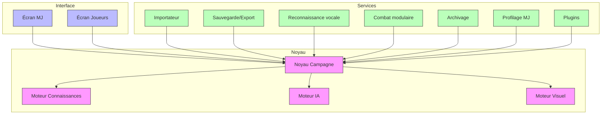

# Copilote du Maître du Jeu – Cahier des Charges Technique

## Résumé exécutif

Cet assistant logiciel est conçu comme un **second cerveau du Maître du Jeu (MJ)**. Il accompagne la durée de vie complète d’une campagne de jeu de rôle, en stockant **localement** toutes les informations importantes (chronologie, PNJ, secrets, inventaires, etc.) et en proposant, à la demande du MJ, des suggestions fondées sur l’IA. L’application fonctionne en mode « offline first » (entièrement locale) pour assurer fiabilité et confidentialité. Aucune donnée sensible n’est envoyée vers un serveur externe. Par exemple, maintenir les données sur le terminal réduit le risque de fuites et d’accès non autorisé. La persistance peut reposer sur une base embarquée comme SQLite : ce moteur léger, ultra-diffusé dans les OS mobiles et desktop, stocke toute la base (tables, schéma, index, données) dans un unique fichier, garantissant simplicité et portabilité. Les formats d’échange seront des standards ouverts (Markdown, JSON, PDF) pour faciliter l’intégration avec d’autres outils et la lecture par l’humain.  

L’outil est **modulaire et adaptable**. Chaque campagne possède sa propre configuration (profils de jeu, niveau d’assistance, modules activés). Il ne remplace pas le MJ, mais l’aide dans son improvisation sans l’interrompre ni lui imposer de workflow. L’interface principale est double : un écran réservé au MJ (interface discrète avec panneau d’assistant) et un écran pour les joueurs (affichage interactif de cartes, personnages, etc.). Le développement se fera par itérations : V1 fournit les fonctions de base (import de campagne, mémoire persistante, suggestions IA, sauvegarde), V2 ajoute le profilage MJ et les outils de préparation de séance, V3 intègre le module combat avancé et les ambiances automatiques, et V4/V5 couvrent l’interaction des joueurs (applications mobiles, synchronisation).  

**Principes fondamentaux clés :** le MJ reste toujours *maître de la partie*, l’IA n’intervient que sur demande et ne change jamais la campagne sans validation. L’application effectue **zéro intrusion** dans la narration et demande peu d’efforts supplémentaires au MJ. La campagne est **persistante** (importée une fois puis mise à jour séance après séance). Le système est **modulaire** (les fonctionnalités non utilisées peuvent être désactivées). Chaque utilisateur (MJ) et chaque campagne sont profilés afin d’adapter l’outil à son style. Les sauvegardes incrémentales automatiques (toutes les X minutes et fin de séance) garantissent la fiabilité. En somme, c’est un **“système d’exploitation modulaire pour maîtres du jeu”**, focalisé sur la mémoire et le conseil (niveau IA 2) plutôt que sur l’automatisation absolue.

## 1. Principes fondamentaux (priorités élevées)

1. **Le MJ reste l’unique maître de la partie.** L’IA ne prend aucune décision à sa place. Elle assiste en suggestions (niveau 2) sans modifier automatiquement la campagne.
2. **Zéro intrusion.** L’application n’interrompt jamais le MJ (pas de pop-up forcé ni de sonnerie). L’interface est discrète : suggestions toujours disponibles sur demande, pas de notifications intempestives.
3. **Campagne persistante.** On importe une fois la campagne (BD, PDF ou autre) puis on ne répète jamais l’import. Toutes les modifications (PNJ rencontrés, événements, notes) sont appliquées à la même base de données interne au fil des séances.
4. **Zéro travail supplémentaire.** Le MJ ne double pas son travail. Toute information existante est enrichie sans ressaisie fastidieuse. On évite la saisie redondante : l’assistant agit comme une surcouche.
5. **Séparation stricte des connaissances.** On distingue *monde réel* (données effectives de la campagne), *connaissances MJ* (informations cachées aux joueurs) et *connaissances joueurs* (découvertes, théories). Chaque niveau n’est affiché que là où il doit l’être.
6. **Profilage du MJ.** Au premier démarrage (ou en config campagne), le MJ indique son style (narratif vs tactique, improvisateur vs scénario strict, etc.). L’IA adapte ensuite son comportement (fréquence et type de suggestions) en fonction des usages.
7. **Apprentissage progressif.** L’application observe les usages du MJ (module consultés, actions fréquentes) et affine ses réglages (par ex. masquer un module rarement utilisé). Elle apprend les préférences du MJ sans intervenir sans autorisation.
8. **Le visuel est interchangeable et facilitateur.** Tout élément (PNJ, lieu, carte) peut avoir plusieurs illustrations. Les images complètent les données textuelles sans les remplacer. L’IA peut proposer des portraits/ambiances générées, mais l’utilisateur peut importer ou modifier ces visuels à tout moment.
9. **Adaptation à la campagne et au MJ.** Chaque campagne possède ses réglages indépendants (modules actifs, seuils d’archivage, style). L’outil s’ajuste à la campagne en cours, pas l’inverse. Par exemple, une campagne extrêmement tactique activera le moteur de combat, une campagne narrative le désactivera, selon la configuration donnée.
10. **Amélioration continue par versions.** Le projet évolue par étapes (voir § Roadmap), avec à chaque version des fonctionnalités livrables clairement définies. Cela priorise un déploiement rapide des éléments critiques.

## 2. Description détaillée des fonctionnalités

### 2.1 Noyau Campagne

Ce module central gère la structure globale de la campagne et de chaque séance :

- **Création/Import** : Supporte l’importation d’un document source (PDF, texte, fichiers). Au premier lancement, on crée une campagne vide ou on importe un scénario existant.
- **Sessions et chronologie** : Tout au long de la partie, l’historique est enrichi séance après séance. Chaque séance génère un « snapshot » stocké localement (fichier `.cmjsave` par exemple). L’historique des événements reste accessible à tout moment.
- **Chronologie et événements** : Le moteur registre un historique linéaire de la campagne (dates, actions clés). Le MJ peut ajouter manuellement des entrées (boutons rapides, notes) ou via reconnaissance vocale. Un **filtre temporel** permet de naviguer entre les séances passées (p. ex. « que s’est-il passé il y a 5 séances ?»).
- **Conséquences** : Les actions majeures (PNJ tué, objet trouvé) activent des « conséquences à long terme » modifiées automatiquement (ex. augmentation du crime si le chef des bandits est tué). Ces conséquences sont stockées pour usage futur.
- **Multi-campagnes** : L’application supporte plusieurs campagnes en parallèle. L’écran d’accueil présente la liste des campagnes existantes (avec résumé rapide : nom, dernière séance, nombre de séances, secrets découverts…). On peut basculer facilement de l’une à l’autre.
- **Archivage** : Au-delà d’un certain seuil (par défaut 100 séances, mais paramétrable), l’application propose d’archiver les anciennes séances. Les données ne sont pas supprimées, mais déplacées dans un espace « archivé » pour alléger les vues courantes. Ce seuil d’archivage est configurable par campagne.

### 2.2 Moteur Connaissances

Ce module gère les **entités du monde du jeu** avec leurs relations et statuts :

- **Entités principales** : PNJ (personnages non joueurs), Joueurs (PJ), Lieux, Objets, Factions, Quêtes, Secrets, Théories des joueurs, etc. Chaque entité a un « dossier » stockant nom, description, images associées, historique, notes du MJ.
- **Relations** : On peut lier entités entre elles (ex. Eldric connaît le maire, le maire finance les bandits). Le moteur enregistre automatiquement certaines relations détectées lors de l’import (voir Importateur). Les relations évoluent (ex. confiance/méfiance) et peuvent influencer les suggestions.
- **Théories des joueurs** : Un onglet permet au MJ de noter ce que croient actuellement les joueurs (ex. « Les joueurs pensent que le forgeron est coupable »). Ces informations servent à guider les suggestions de l’IA.
- **Sécrets** : Les informations cachées aux joueurs sont stockées séparément (Secrets découverts ou encore à révéler). Lorsqu’un secret est révélé en partie, il passe en « découvert ».
- **Module combat (optionnel)** : Lorsqu’activé (configurable par campagne), ce moteur gère l’état des combats tactiques (vue de grille, initiative, portées). En mode avancé (Niveau D), on prend en compte obstacles, effets de zone, déplacements finement. Si désactivé ou mode léger, ce sous-système est inactif.

### 2.3 Moteur IA

L’IA apporte soutien et analyses, toujours sur demande du MJ :

- **Analyse contextuelle** : À partir de l’historique et des données actuelles, l’IA peut détecter les incohérences (p. ex. PNJ mentionné deux fois différemment) et alerter le MJ s’il le demande.
- **Résumé et préparation** : Avant chaque séance, l’IA génère un résumé de la séance précédente (scène par scène) ainsi qu’une liste d’éléments non-résolus (PNJ à interroger, portes fermées, indices oubliés). Ces suggestions aident le MJ à préparer la suite.
- **Suggestions de relance** : Si les joueurs tournent en rond, le MJ peut cliquer sur des boutons tels que « 💡 Je suis bloqué », « 🧩 Résume la situation », « 🎯 Fais avancer la partie », « 💬 Réaction PNJ ». L’IA proposera des idées contextualisées : nouveaux indices, actions de PNJ, rumeurs à lancer. (Niveau IA 2 seulement – elle ne prend pas de décisions automatiques.)
- **Reconnaissance de textes (OCR)** : En important un PDF de campagne, l’IA identifie automatiquement les PNJ, lieux, quêtes, secrets cités dans le document. Elle peut pré-remplir les fiches (voir Priorités d’import, section 4).
- **Gestion des dialogues** : Enregistrements vocaux déclenchés par le MJ sont transcrits et analysés. L’IA extrait les actions clés et propose la mise à jour du journal de campagne ou l’ajout d’entrées d’historique sans intervention de saisie (botte secrète optionnelle).
- **Respect de l’intention du MJ** : Toutes les propositions sont soumises au MJ pour validation. L’IA affiche des options (« modifier l’intrigue », « ajouter un indice ici », etc.) que l’utilisateur peut accepter ou rejeter. Aucun changement n’est appliqué automatiquement.

### 2.4 Moteur Visuel

Gère tous les aspects visuels et multimédias :

- **Portraits et images IA** : L’IA peut générer des illustrations de PNJ ou d’ambiances (lieux, forêts, tavernes) sur demande. Par exemple, on peut demander « Génère l’avatar d’Eldric, aubergiste barbu de 55 ans ». Ces images servent de base modifiable.
- **Import multimédia** : L’utilisateur peut importer ses propres images (PNG, JPG) pour PNJ, décors, cartes. Chaque entité a une galerie de médias (portrait, lieu, icônes d’objets).
- **Cartes interactives** : L’écran Joueurs peut afficher des cartes de zones de jeu. Le MJ peut placer des marqueurs, gérer le *fog of war*, laisser des notes visibles ou cachées. Les joueurs voient en temps réel le déplacement de leurs pions.  
- **Ambiances automatiques** : En fonction du contexte (intérieur, extérieur, nuit, pluie, etc.), le moteur applique automatiquement un fond d’écran ou un thème visuel sur l’écran Joueurs pour renforcer l’immersion. Ces transitions sont gérées sans que le MJ ait à changer manuellement d’image.
- **Visuels adaptatifs** : Par exemple, si le camp incendie se propage ou si le temps change, l’application ajuste l’image de fond. Tout reste paramétrable.

### 2.5 Écran MJ (Interface Maître du Jeu)

Interface principale, uniquement visible du MJ :

- **Tableau de bord discret** : Affiche les informations essentielles (chronologie rapide, PNJ rencontrés, quêtes en cours). Un panneau latéral propose des actions rapides (notes, lancer IA, accès fiches).
- **Panneau Assistant IA** : Accessible par un bouton (par ex. « 🤖 Copilote »). On y consulte les suggestions de l’IA sans masquer l’écran de jeu. L’IA n’apparaît que sur demande.
- **Prises de notes et actions rapides** : Boutons pour enregistrer une entrée au journal (« Les joueurs interrogent le forgeron », etc.), ajouter un **post-it** à un PNJ, ou taguer un secret découvert.
- **Historique et recherche** : Permet de rechercher n’importe quelle entité ou événement du passé en quelques clics, sans quitter la partie.
- **Gestion des modules** : Permet d’activer/désactiver les sous-modules selon la campagne (ex. combats, cartes, reconnaissance vocale, etc.).
- **Double écran** : Si un second écran est présent, l’interface MJ peut être déplacée sur un écran tandis que l’autre affiche l’écran joueurs.

### 2.6 Écran Joueurs

Vue publique partagée avec tous les joueurs :

- **Affichage interactif** : Montre la carte ou l’environnement actuel, les portraits des PJ (avec stats visibles ou masquées selon besoin), les infos connues des joueurs (ex. portrait d’un PNJ après rencontre, carte partielle du donjon).
- **Pas d’infos MJ** : Ne jamais montrer les secrets ou notes du MJ. Le contenu est filtré pour n’afficher que ce que les joueurs ont découvert.
- **Interactions** : Les joueurs peuvent annoter une carte, déplacer leur pion (si une interface tactile ou jeu en ligne). Ils ne peuvent modifier que leurs éléments (fiches PJ, notes perso).
- **Synchronisation** : À terme (V4+), cet écran pourra être accessible depuis les appareils des joueurs via code de session, sans obligation d’installation (application Web ou mobile sécurisée).

### 2.7 Importateur

Analyse automatique de documents de campagne :

- **Extraction de données** : À partir d’un PDF ou d’un texte structuré, l’outil détecte les entités clés :
  - **PNJ** (noms, caractéristiques, lieux associés)
  - **Lieux** (noms de villes, salles, forêts)
  - **Quêtes/Objectifs** (titres, résumés)
  - **Secrets mentionnés** (points occultes, preuves)
- **Pré-remplissage de fiches** : Génère les fiches PNJ correspondantes (nom, rôle, image proposée) et ajoute lieux et quêtes au dossier de campagne. Le MJ valide ou ajuste ces fiches.
- **Hyperliens automatiques** : Crée des liens entres entités (ex. PNJ ↔ Lieu visité). Elle peut aussi détecter un graphe social rudimentaire (qui connaît qui).
- **Chronologie initiale** : Propose une timeline globale tirée des chapitres importés. Cela sert de point de départ que le MJ enrichit ensuite au fil de la partie.

### 2.8 Sauvegarde / Export

Garantit la pérennité des données :

- **Sauvegarde locale** : Toutes les données de campagne sont stockées localement sur l’ordinateur du MJ. Chaque séance peut être « clôturée » dans un fichier de sauvegarde (`.cmjsave`) et la campagne entière dans un fichier principal (`.cmj`). Le format doit être facilement sérialisable (par ex. base SQLite ou fichier JSON compressé).
- **Auto-save incrémental** : Pour éviter toute perte, l’application enregistre automatiquement à intervalles réguliers (modifiable en paramètres) et avant la fermeture de l’application.
- **Exports lisibles** : À la fin de chaque séance, le MJ est invité à exporter un résumé (PDF/Markdown) et/ou les données brutes (JSON) pour archivage externe.  
  - *PDF* : Document richement formaté (titre, date, durée, résumé narratif, événements clés, trésors trouvés, intrigues en cours, notes du MJ). Adapté pour impression ou partage.
  - *Markdown* : Version texte, facile à relire et réutiliser (par ex. dans un wiki). Il reprend le même contenu en syntaxe légère.
  - *JSON* : Export complet des données structurées de la séance (idées pour intégration dans d’autres outils ou synchronisation future).
- **Arborescence de fichiers** : Exemple de structure locale :  
  ```text
  Campagnes/
  └─ MaCampagne/
     ├─ Campagne.cmj              (fichier principal)
     ├─ Seances/
     │   ├─ Seance_001.cmjsave    (sauvegardes de séances)
     │   ├─ Seance_002.cmjsave
     │   └─ ...
     └─ Exports/
         ├─ Résumé_2026-06-21.pdf  (export fin de séance)
         ├─ Résumé_2026-06-21.md
         └─ Résumé_2026-06-21.json
  ```  
- **Plan d’export** : La fonction *Export* utilise des bibliothèques de génération de documents (par ex. `jsPDF` ou `pdfkit` pour PDF, ou simplement la conversion Markdown→HTML→PDF). Le code de l’application assemble les sections (Titre, date, événements, etc.) puis produit les fichiers correspondants selon la sélection du MJ.

### 2.9 Reconnaissance vocale

- **Activation manuelle** (Niveau A). L’écoute n’est pas continue. Le MJ décide quand enregistrer : bouton « Start listening » et « Stop ». La transcription (API locale ou service intégré) est affichée pour corrections éventuelles.
- **Analyse post-écoute** : À l’arrêt de l’enregistrement, le texte est analysé pour en extraire les informations utiles (actions des joueurs, décisions, dialogues importants). Ces éléments peuvent être ajoutés au journal de campagne automatiquement (avec validation du MJ).
- **Respect de la vie privée** : Pas d’enregistrement permanent (lié au principe n°8). Les enregistrements (audio ou texte) ne sont pas conservés hors contexte et ne sont envoyés nulle part.

### 2.10 Combat modulaire

- **Mode de base** (optionnel) : Si désactivé, l’application ne gère aucun combat. Le MJ peut alors utiliser son méthode habituelle hors de l’outil.
- **Mode tactique** : Active un sous-module de combats sur une grille ou carte. Gestion de l’initiative, déplacements en cases, jet de dés numériques possibles.  
- **Niveau D (optionnel)** : Déplacements précis, obstacles, couverture, effets de zone (sorts, explosions), gestion détaillée de l’initiative. Ce module peut être activer/désactiver par campagne. L’objectif est de ne pas surcharger une campagne narrative.
- **Intégration UI** : Sur l’écran MJ on gère les statistiques de combat ; sur l’écran Joueurs on voit la grille animée avec les pions. Toutes les actions restent contrôlées par le MJ.

### 2.11 Archivage intelligent

- **Archivage automatique** : Lorsqu’une campagne dépasse le seuil défini (ex. 100 séances), une alerte propose soit de continuer normalement, soit d’archiver les premières séances dans un dossier séparé, ou de créer une « nouvelle saison ».  
- **Gestion de l’espace** : L’archivage diminue la charge de mémoire active (par ex. les premières séances ne sont plus chargées en mémoire principale). Les anciens fichiers restent accessibles pour consultation ou restauration.
- **Paramètre ajustable** : Le seuil d’archivage (nombre de séances, taille de la base) est réglable par campagne.

### 2.12 Profilage MJ

- **Configuration initiale** : Lors du premier lancement (ou à chaque nouvelle campagne), un assistant demande les préférences du MJ (style narratif vs tactique, niveau de détails, reconnaissance vocale ou non, etc.). Ces choix modèlent l’interface et le comportement du système.
- **Options dynamiques** : Un curseur « Niveau d’assistance IA » permet de définir si l’IA doit proposer peu d’idées (« discret ») ou plus d’interventions (« assisté »).  
- **Adaptation progressive** : Le système surveille les modules les plus utilisés. Si un module est rarement utilisé (ex. combat dans une campagne narrative), il peut être masqué par défaut avec une option pour le réactiver. Un message comme « Vous utilisez rarement le module Combat. Le masquer ? » illustre ce principe.

### 2.13 Plugins et extensibilité

- **Architecture modulaire** : Au-delà des modules natifs, on prévoit un mécanisme de plugins. Chaque plugin peut étendre les entités (ex. fiche dédiée pour D&D 5e, Pathfinder, Cyberpunk), proposer de nouvelles sources d’export, ou synchroniser les données.
- **Exemples** : Plugin *Export Foundry* pour créer des données exploitables sur des plateformes VTT; Plugin *Son & Musique* pour ajouter des ambiances sonores automatiques; Plugin *Synchronisation Android* pour la connexion en temps réel des applis mobiles des joueurs.
- **API interne** : Les modules natifs communiquent via des API ou services internes documentés (par ex. accès aux données du Noyau Campagne), facilitant l’extension par un développeur tiers.

## 3. Exigences non-fonctionnelles

- **Sécurité et confidentialité** : Aucune donnée n’est stockée dans le cloud. Tout reste local (gestion offline complète). Cela améliore la sécurité des données sensibles (campagnes privées, secrets de scénario). SQLite (par exemple) ne gère pas d’utilisateurs : on estime que le fichier de base est protégé par les droits système du PC. Pour plus de sécurité, on peut envisager en option le chiffrement du fichier (SQLCipher ou système de cryptage natif).
- **Performances** : La volumétrie reste modérée (quelques dizaines de milliers de lignes au plus). SQLite supporte très bien des bases de plusieurs Go sans perte notable de performance. Les requêtes sont locales (pas de latence réseau). Le design doit rester réactif même en campagne longue (100+ séances).
- **Modularité** : Tous les composants doivent être découplés. Une campagne n’utilisera que les modules activés pour elle, minimisant l’empreinte mémoire/CPU. Par exemple, si le combat modulaire est désactivé, les classes de combat ne sont pas chargées.
- **Multi-campagnes** : L’application pourra gérer plusieurs campagnes sans conflit (dossiers de campagne séparés, instances multiples). Elle doit pouvoir les ouvrir/switcher efficacement.
- **Longévité** : Conçue pour durer au moins plusieurs années/centaines de séances, la base de données choisie doit être stable (SQLite est recommandé pour sa robustesse à long terme). Les sauvegardes incrémentales protègent contre la corruption.
- **Interopérabilité** : Les formats d’export (PDF, Markdown, JSON) sont standards et pourront être ouverts/analysés par d’autres outils. Le Markdown est prisé pour sa lisibilité facile.
- **Plateformes visées** : Version 1 sur Windows (exécutable local). Version 2+ portage sous Android (ou PWA) pour permettre la connexion mobile. À terme, distribution multi-plateformes (Windows, Mac, Linux, Android) via installateurs ou stores officiels.
- **Interface adaptative** : L’UI doit bien s’afficher en mode plein écran ou fenêtré, sur divers résolutions. Support de deux écrans (détecter et proposer de placer l’écran Joueurs sur le second).
- **Localisation** : L’interface sera au minimum en français, et pourra supporter l’anglais pour export ou communautés internationales.
- **Aucune écoute/connexion permanente** : La reconnaissance vocale est strictement sur demande, aucune connexion réseau n’est requise en permanence (principe n°8). Pas d’API externes, à moins d’offrir du contenu additionnel (mais ce n’est pas prévu initialement).

## 4. Cas d’usage et flux utilisateurs

- **Création ou import d’une campagne** : L’utilisateur ouvre l’application, clique sur *Nouvelle campagne* ou *Importer*. En import, il sélectionne un PDF ou un dossier existant. L’application analyse et pré-remplit les fiches (voir Importateur). Le MJ peut compléter manuellement (ajouter un PNJ, créer un lieu, etc.).  
- **Déroulement d’une séance** : Le MJ démarre la séance en mode « en cours ». Pendant le jeu :
  - Il utilise la reconnaissance vocale (bouton d’écoute) pour dicter les actions majeures, ou saisit rapidement des notes via boutons prédéfinis.
  - Il peut lancer l’IA (ex. « 😵 J’ai besoin d’aide », « 🕵️ Décrivez la réaction de ce PNJ ») ; l’IA propose des idées sans interrompre le MJ.
  - En combat, le MJ active le mode combat sur demande et gère le tableau de combat sur l’écran Joueurs.
  - Le MJ consulte les fiches d’entités sur l’écran MJ (ex. fiche d’un PNJ rencontré) et les met à jour. L’écran Joueurs montre l’action (carte, pions, infos PNJ approuvées).
- **Fin de séance** : Le MJ clique sur *Fin de séance*. Un dialogue s’ouvre (voir flowchart ci-dessous) :

  ```mermaid
  flowchart LR
    Fin[Fin de la séance] --> Choix{Clôturer la séance ?}
    Choix -->|Sauvegarder| Save[Sauvegarder la séance]
    Choix -->|Exporter| Export[Exporter le résumé]
    Choix -->|Les deux| Both[Sauvegarder et Exporter]
    Choix -->|Annuler| Cancel[Annuler]
    Save --> End[Terminé]
    Export --> End
    Both --> End
    Cancel --> End
  ```

  - *Sauvegarder* enregistre l’état de la session (`.cmjsave`) et met à jour la campagne principale.
  - *Exporter* lance la génération du fichier PDF/MD/JSON de résumé (contenant titre, date, durée, événements clés, statistiques importantes, notes MJ).
  - *Les deux* effectue sauvegarde + export.
  - *Annuler* revient sans rien faire.
- **Après la séance** : Le MJ retrouve la campagne enrichie de cette séance. Il peut cliquer sur *Préparer séance suivante* pour afficher le résumé automatique et la liste d’éléments en suspens.  
- **Consulter en dehors du jeu (option joueurs)** : Dans les versions futures, chaque joueur pourra lancer l’application mobile et entrer le code de campagne. Il verra alors son personnage (fiche, inventaire, notes personnelles, résumé des séances passées) sans rien révéler du reste. Les joueurs n’ont pas besoin d’installer l’application complète, juste un client léger (Android/PWA).

## 5. Architecture technique proposée

L’architecture est modulaire, autour de quatre noyaux principaux :



- **Modules internes** : Chaque boîte ci-dessus représente un module ou service. Les flèches indiquent l’accès aux données du *Noyau Campagne* central. Par exemple, l’*Écran MJ* (UI) interagit avec le Noyau et le Moteur Connaissances pour afficher/éditer des entités. L’Importateur construit les données initiales du Noyau.
- **APIs internes** : Les communications peuvent se faire par appels de fonctions internes (si l’application est monolithique) ou par APIs locales (ex. routes REST internes ou bus d’événements), surtout si on passe à une architecture microservices plus tard.
- **Formats d’export** : 
  - *PDF* : Généré via une bibliothèque de création de PDF (par exemple `wkhtmltopdf` ou `puppeteer` pour générer à partir d’un template HTML/CSS).
  - *Markdown* : Création de fichiers `.md` en texte simple. (Le Markdown est un format de balisage léger très répandu.)
  - *JSON* : Sérialisation des structures de données de la séance (utile pour réimport ou interface externe).
- **Base de données** : Une BD embarquée est recommandée (SQLite). Elle offre **zéro configuration** (aucun serveur à lancer), portabilité (un seul fichier unique, même format sur toutes les plateformes) et fiabilité. SQLite satisfait les besoins (mono-utilisateur) et est optimisé pour les lectures/écritures locales rapides. Alternativement, on pourrait utiliser un simple stockage sérialisé (JSON) ou un système clé/valeur embarqué (LevelDB, Realm) mais SQLite est prioritaire en raison de sa maturité.
- **Stockage local** : Tout est stocké sur le disque du MJ, dans le dossier Campagnes. Aucun service réseau n’est requis (excepté l’éventuel téléchargement de mises à jour ou de ressources graphiques facultatives).
- **Options offline-first** : Comme le recommande l’architecture Android, la couche de données locales est « source de vérité ». L’application lit/écrit toujours local, même si à terme on intègre un mode « synchronisation cloud » (pour V4/V5). Cela garantit que l’application fonctionne intégralement hors-ligne (cahier des charges prioritaires).
- **Intégration continue / déploiement** : À la sortie, on distribuera un installateur Windows (EXE ou MSI). Pour Android, on préparera un APK ou une PWA. La modularité facilite la mise à jour incrémentale des modules individuels.

### 5.1 Schéma détaillé de la Base de Données SQLite

Pour assurer la persistance et l'intégrité des données importées depuis le Codex, l'application s'appuie sur une base SQLite locale. Voici le schéma SQL des tables, avec relations par clés étrangères et index de performance :

```sql
-- Table des campagnes
CREATE TABLE campaigns (
    id TEXT PRIMARY KEY,
    title TEXT NOT NULL,
    description TEXT,
    language TEXT NOT NULL DEFAULT 'fr-FR',
    author TEXT,
    date_start TEXT, -- Format ISO YYYY-MM-DD
    version TEXT NOT NULL DEFAULT '1.0.0'
);

-- Table des chapitres
CREATE TABLE chapters (
    id TEXT PRIMARY KEY,
    campaign_id TEXT NOT NULL,
    title TEXT NOT NULL,
    description TEXT,
    FOREIGN KEY (campaign_id) REFERENCES campaigns(id) ON DELETE CASCADE
);

-- Table des séances
CREATE TABLE sessions (
    id TEXT PRIMARY KEY,
    campaign_id TEXT NOT NULL,
    chapter_id TEXT,
    session_date TEXT NOT NULL, -- Format ISO YYYY-MM-DD
    title TEXT NOT NULL,
    duration TEXT,
    location_id TEXT,
    summary TEXT,
    FOREIGN KEY (campaign_id) REFERENCES campaigns(id) ON DELETE CASCADE,
    FOREIGN KEY (chapter_id) REFERENCES chapters(id) ON DELETE SET NULL
);

-- Table des lieux
CREATE TABLE locations (
    id TEXT PRIMARY KEY,
    campaign_id TEXT NOT NULL,
    name TEXT NOT NULL,
    type TEXT NOT NULL,
    description TEXT,
    FOREIGN KEY (campaign_id) REFERENCES campaigns(id) ON DELETE CASCADE
);

-- Table des factions
CREATE TABLE factions (
    id TEXT PRIMARY KEY,
    campaign_id TEXT NOT NULL,
    name TEXT NOT NULL,
    description TEXT,
    alignment TEXT,
    FOREIGN KEY (campaign_id) REFERENCES campaigns(id) ON DELETE CASCADE
);

-- Table des médias/images
CREATE TABLE media (
    id TEXT PRIMARY KEY,
    campaign_id TEXT NOT NULL,
    file_path TEXT NOT NULL,
    caption TEXT,
    FOREIGN KEY (campaign_id) REFERENCES campaigns(id) ON DELETE CASCADE
);

-- Table des PNJs
CREATE TABLE npcs (
    id TEXT PRIMARY KEY,
    campaign_id TEXT NOT NULL,
    name TEXT NOT NULL,
    role TEXT NOT NULL,
    description TEXT,
    faction_id TEXT,
    image_id TEXT,
    FOREIGN KEY (campaign_id) REFERENCES campaigns(id) ON DELETE CASCADE,
    FOREIGN KEY (faction_id) REFERENCES factions(id) ON DELETE SET NULL,
    FOREIGN KEY (image_id) REFERENCES media(id) ON DELETE SET NULL
);

-- Table des joueurs
CREATE TABLE players (
    id TEXT PRIMARY KEY,
    campaign_id TEXT NOT NULL,
    name TEXT NOT NULL,
    FOREIGN KEY (campaign_id) REFERENCES campaigns(id) ON DELETE CASCADE
);

-- Table des personnages joueurs (PJs)
CREATE TABLE characters (
    id TEXT PRIMARY KEY,
    player_id TEXT NOT NULL,
    name TEXT NOT NULL,
    class TEXT,
    level INTEGER NOT NULL DEFAULT 1,
    hp INTEGER NOT NULL DEFAULT 0,
    image_id TEXT,
    FOREIGN KEY (player_id) REFERENCES players(id) ON DELETE CASCADE,
    FOREIGN KEY (image_id) REFERENCES media(id) ON DELETE SET NULL
);

-- Table des objets
CREATE TABLE items (
    id TEXT PRIMARY KEY,
    campaign_id TEXT NOT NULL,
    name TEXT NOT NULL,
    type TEXT NOT NULL,
    description TEXT,
    owner_character_id TEXT,
    owner_location_id TEXT,
    image_id TEXT,
    FOREIGN KEY (campaign_id) REFERENCES campaigns(id) ON DELETE CASCADE,
    FOREIGN KEY (owner_character_id) REFERENCES characters(id) ON DELETE SET NULL,
    FOREIGN KEY (owner_location_id) REFERENCES locations(id) ON DELETE SET NULL,
    FOREIGN KEY (image_id) REFERENCES media(id) ON DELETE SET NULL
);

-- Table des secrets
CREATE TABLE secrets (
    id TEXT PRIMARY KEY,
    campaign_id TEXT NOT NULL,
    title TEXT NOT NULL,
    is_discovered INTEGER NOT NULL DEFAULT 0, -- 0 = Faux, 1 = Vrai
    description TEXT,
    FOREIGN KEY (campaign_id) REFERENCES campaigns(id) ON DELETE CASCADE
);

-- Table des relations (graphe social et inter-entités)
CREATE TABLE relations (
    id TEXT PRIMARY KEY,
    campaign_id TEXT NOT NULL,
    source_id TEXT NOT NULL, -- ID d'un PNJ, PJ ou faction
    target_id TEXT NOT NULL, -- ID d'un PNJ, PJ ou faction
    relation_type TEXT NOT NULL,
    value INTEGER NOT NULL DEFAULT 0,
    FOREIGN KEY (campaign_id) REFERENCES campaigns(id) ON DELETE CASCADE
);

-- Table des théories des joueurs
CREATE TABLE theories (
    id TEXT PRIMARY KEY,
    campaign_id TEXT NOT NULL,
    player_id TEXT NOT NULL,
    text TEXT NOT NULL,
    target_id TEXT, -- ID d'un PNJ, lieu ou secret concerné
    FOREIGN KEY (campaign_id) REFERENCES campaigns(id) ON DELETE CASCADE,
    FOREIGN KEY (player_id) REFERENCES players(id) ON DELETE CASCADE
);

-- Table des notes du MJ
CREATE TABLE notes (
    id TEXT PRIMARY KEY,
    campaign_id TEXT NOT NULL,
    note_date TEXT NOT NULL,
    author TEXT NOT NULL DEFAULT 'MJ',
    text TEXT NOT NULL,
    FOREIGN KEY (campaign_id) REFERENCES campaigns(id) ON DELETE CASCADE
);

-- Table de liaison N-N pour les personnages présents dans une séance
CREATE TABLE session_characters (
    session_id TEXT NOT NULL,
    character_id TEXT NOT NULL,
    PRIMARY KEY (session_id, character_id),
    FOREIGN KEY (session_id) REFERENCES sessions(id) ON DELETE CASCADE,
    FOREIGN KEY (character_id) REFERENCES characters(id) ON DELETE CASCADE
);

-- Index pour optimiser les requêtes fréquentes
CREATE INDEX idx_sessions_campaign ON sessions(campaign_id);
CREATE INDEX idx_npcs_campaign ON npcs(campaign_id);
CREATE INDEX idx_npcs_faction ON npcs(faction_id);
CREATE INDEX idx_items_owner_char ON items(owner_character_id);
CREATE INDEX idx_items_owner_loc ON items(owner_location_id);
CREATE INDEX idx_relations_source ON relations(source_id);
CREATE INDEX idx_secrets_campaign ON secrets(campaign_id);
```

### 5.2 Moteur IA : Prompting et Gestion du Contexte

Pour que l'assistant IA fournisse des réponses cohérentes et pertinentes sans dévoiler prématurément de secrets ni contredire les faits établis, un système d'assemblage du contexte est mis en œuvre.

#### A. Sélection et Filtrage du Contexte
Avant d'envoyer une requête au modèle d'IA locale, l'application extrait :
1. **La situation présente :** La séance en cours, le lieu actuel et les PJ présents.
2. **L'historique récent :** Les résumés et notes des 3 dernières séances.
3. **Le graphe de connaissances :** Fiches des PNJs présents dans le lieu, factions locales et relations existantes.
4. **Les Secrets :** Divisés entre *Secrets Découverts* (qui peuvent être librement référencés par l'IA) et *Secrets Non Découverts* (que l'IA doit chercher à faire découvrir subtilement sans les énoncer abruptement).
5. **Les Théories des Joueurs :** Pour orienter les suggestions d'improvisation dans le sens des théories ou, au contraire, créer de fausses pistes narratives.

#### B. Structure des Prompts IA (Systèmes d'invites)

* **Fonctionnalité : « 💡 Je suis bloqué »**
  ```text
  [System Instruction]
  Tu es le copilote narratif d'un Maître de Jeu (MJ) de jeu de rôle. Ton rôle est de proposer 3 suggestions d'improvisation rapides et concrètes pour relancer la partie.
  Voici les contraintes :
  - Ne crée pas de contradiction avec l'historique et les PNJs existants.
  - Utilise les secrets non découverts pour instiller des indices subtils.
  - Adapte le ton au style de la campagne (ici : {style_mj}).

  [Context]
  Campagne : {campagne_titre} ({description})
  Lieu actuel : {lieu_nom} - {lieu_description}
  PJs présents : {liste_pjs}
  Secrets non découverts : {liste_secrets_caches}
  Théories actuelles des joueurs : {liste_theories}
  Dernier événement marquant : {dernier_evenement}

  [Prompt]
  Les joueurs tournent en rond dans {lieu_nom} et ne savent pas quoi faire. Propose 3 rebondissements ou actions immédiates.
  ```

* **Fonctionnalité : « 💬 Réaction PNJ »**
  ```text
  [System Instruction]
  Tu incarnes le PNJ {pnj_nom} lors d'une interaction improvisée avec les joueurs. Rédige ses lignes de dialogue ou son comportement immédiat.
  Respecte scrupuleusement sa fiche de personnage et son attitude envers les PJ.

  [Context]
  PNJ : {pnj_nom} (Rôle: {pnj_role}, Description: {pnj_description})
  Factions affiliées : {pnj_faction}
  Relations avec les PJ : {relations_pjs}
  Secrets que ce PNJ connaît : {secrets_connus}
  Secrets qu'il cache : {secrets_caches}

  [Prompt]
  Un des joueurs (de classe {pj_classe}) tente de {action_joueur} face à {pnj_nom}. Décris la réaction verbale et physique du PNJ en restant concis et immersif.
  ```

### 5.3 Sécurité et Confidentialité Locale

Afin de garantir que les données de la campagne (y compris les notes intimes et secrets du MJ) restent privées et sécurisées sur sa machine locale :
1. **Chiffrement SQLite (Optionnel) :** La base de données de campagne (`Campagne.cmj`) peut être cryptée à l'aide de **SQLCipher** (AES-256). La clé de déchiffrement est dérivée du mot de passe de session de l'utilisateur via PBKDF2 et stockée de manière sécurisée dans le gestionnaire de clés du système d'exploitation (Windows Credential Manager / macOS Keychain).
2. **Prévention du Path Traversal :** L'importateur de médias locaux valide strictement les chemins relatifs. Il interdit l'accès aux répertoires parents via des patterns `../` pour éviter qu'un fichier Codex corrompu ne lise ou n'écrive des fichiers système critiques.
3. **Intégrité des fichiers :** À la clôture de chaque séance, une signature de hachage SHA-256 du fichier de sauvegarde `.cmjsave` est générée pour valider l'intégrité de la sauvegarde lors d'une restauration ultérieure.

### 5.4 Protocole de Synchronisation Locale Multijoueur (V4+)

Le mode multijoueur permet d'envoyer l'état de l'écran Joueurs directement sur les smartphones ou tablettes des participants sans passer par Internet :
1. **Découverte de Service (mDNS) :** La machine du MJ (serveur) publie sa présence sur le réseau local Wi-Fi via le protocole **mDNS / DNS-SD** (type de service `_mjcopilot._tcp`). L'application mobile ou la PWA des joueurs effectue un scan local pour s'y connecter automatiquement sans forcer la saisie manuelle de l'adresse IP.
2. **Serveur de streaming WebSocket local :** Un serveur WebSocket léger (ex: Node-ws ou Fastify) s'exécute sur le PC du MJ. Il diffuse en temps réel un flux JSON décrivant l'état de l'écran Joueurs (coordonnées des pions, Fog of War mis à jour, image de fond d'ambiance active).
3. **Sécurité d'accès :** Lors du premier appairage, les joueurs doivent saisir un code PIN à 4 chiffres généré sur l'écran du MJ pour valider leur droit de lecture/écriture (évitant qu'une personne externe connectée au même Wi-Fi n'accède aux fiches ou ne manipule les pions).


## 6. UI/UX : Double-écran et profilage

- **Écran double** : L’application détecte les écrans connectés. L’interface MJ peut être affichée sur l’écran principal (devant le MJ) et l’écran des joueurs sur un deuxième moniteur ou projecteur. Les joueurs voient un affichage immersif (cartes, images de fond), le MJ voit un tableau de bord fonctionnel.
- **Interface MJ discrète** : Pas de bandeaux ou fenêtres pop-up inattendus. Les suggestions de l’IA sont dans un volet coulissant. Les actions disponibles sont clairement nommées (icônes ou boutons), en évitant de perturber le MJ en cours de narration.
- **Icons et dialogues** : Utilisation d’icônes intuitifs (💡, 🧩, 💬, 🎯…) pour les actions d’IA ou les outils (voir annexe Dialogues). Les menus sont modaux uniquement quand c’est nécessaire (ex. fin de séance).
- **Couleurs et thème** : Palette sobre pour l’écran MJ, ambiance dynamique pour l’écran Joueurs. Par exemple, des tons foncés pour l’UI administrative et des images colorées pour l’écran des joueurs.
- **Paramètres par campagne** : Chaque campagne peut choisir son thème visuel et ses icônes spécifiques (ex. campagne médiévale vs futuriste).

## 7. Plan de versions et priorisation

Le développement sera découpé en versions incrémentales. Ci-dessous les objectifs principaux par version :

| Version  | Fonctionnalités clés                                                                                                     |
|----------|--------------------------------------------------------------------------------------------------------------------------|
| **V1**   | Import de campagne (via PDF), **mémoire persistante** (historique, PNJ, secrets, objets), **Assistant IA** (base), historique des séances, gestion des PNJ & secrets, gestion des conséquences, **sauvegarde/export basique**, gestion des images (import simples), **Écran MJ** principal. |
| **V2**   | **Profilage du MJ** (configuration initiale du style), **préparation de séance assistée** (résumé automatique), **écran Joueurs local** (vue statique sans contrôle à distance), cartographie interactive simple (pions, fog of war), améliorations IA (suggestions rich format). |
| **V3**   | **Moteur combat modulaire** (mode tactique avancé optionnel), **ambiances automatiques** (changement d’images selon contexte), personnalisation avancée (themes, skins), optimisations UI/UX, version Mac/Linux (portage initial). |
| **V4**   | **Connexion joueurs** : app mobile Android/iOS ou PWA pour consultation des fiches PJ et notes de campagne. Début de **synchronisation réseau** (serveur local ou cloud pour parties en ligne). |
| **V5**   | Extensions de plugins, fonctionnalités avancées : plugin final pour intégration VTT (ex. export Foundry), système de serveur de campagne multi-MJ, meilleures capacités de personnalisation graphique, pipeline complet multiplateforme (stores officiels). |

## 8. Tableaux récapitulatifs des priorités

### 8.1 Priorités d’import (Sections A..I)

| Fonctionnalité d’importation      | Priorité (0=inutile,5=indispensable) |
|----------------------------------|--------------------------------------|
| A. Détection automatique des PNJ  | ★★★★★ (5)                            |
| B. Détection des lieux            | ★★★☆☆ (3)                            |
| C. Détection des quêtes           | ★★★★★ (5)                            |
| D. Détection des secrets          | ★★★★★ (5)                            |
| E. Création automatique des liens | ★★★☆☆ (3)                            |
| F. Chronologie automatique        | ★★★★★ (5)                            |
| G. Résumé des chapitres           | ★★☆☆☆ (2)                            |
| H. Détection incohérences (on demand) | À la demande (optionnel)           |
| I. Génération fiches PNJ exploitables | À la demande (optionnel)           |

> *Remarque* : Les fonctions A, C, D, F (PNJ, quêtes, secrets, timeline) sont primordiales pour ne pas noyer le MJ sous la saisie. E (liens) est moins critique si le MJ les crée manuellement. G (résumés) est moins prioritaire car le MJ préfère un résumé par IA à la fin de séance via l’assistant.

### 8.2 Priorités des fonctionnalités visuelles (Sections A..F)

| Fonctionnalité visuelle                 | Priorité (0=inutile,5=indispensable) |
|-----------------------------------------|--------------------------------------|
| A. Génération IA de portraits PNJ       | ★★★★★ (5)                            |
| B. Génération IA d’environnements       | ★★★★☆ (4)                            |
| C. Import d’images personnelles         | ★★★★★ (5)                            |
| D. Galerie d’illustrations par entité   | ★★★★★ (5)                            |
| E. Cartes interactives (pions, fog)     | ★★★★★ (5)                            |
| F. Écran d’ambiance automatique         | ★★★★★ (5)                            |

Chaque fonctionnalité graphique doit être éditable par l’utilisateur. Par exemple, le MJ peut choisir d’importer ses propres visuels (C), qui supplanteront les images générées par l’IA. Les cartes (E) sont cruciales pour les campagnes tactiques. L’écran d’ambiance (F) est fortement prioritaire pour l’immersion.

## 9. Contraintes et hypothèses

- **Plateformes cibles** : Windows (V1), Android/ iOS (V2). Mac et Linux envisagés pour V3. Distribution prévue via installateurs classiques (pas d’abonnement cloud prévu).
- **Installation locale** : Pas de serveur externe requis initialement. La synchronisation multijoueurs future pourrait demander un serveur local ou cloud, mais en V1-V2 tout reste sur la machine du MJ.
- **Confidentialité** : Pas de collecte de données utilisateur. Les fichiers de campagne restent sur l’ordinateur. Aucune connexion permanente à Internet.
- **Niveau IA 2** : L’IA ne modifie que des données secondaires (journal, suggestions). Elle n’affecte ni le script central ni les fiches de personnages sans confirmation du MJ.
- **Usage limité initialement** : Destiné au départ à quelques amis (bêta privée), mais conçu pour être évolutif à un public large (open source ou commercial, selon choix futur).
- **Langue** : Interface en français par défaut. L’export peut être multilingue (ex. résumé en anglais selon la configuration).
- **Performance minimale** : Application desktop standard, pas besoin de GPU ou matériel spécialisé (sauf pour la génération d’images IA éventuelle, qui peut s’appuyer sur un service local ou une bibliothèque légère).
- **Modèles de déploiement** : Aucune dépendance à un framework propriétaire. Utiliser des librairies ouvertes (SQLite, bibliothèques PDF, etc.).
- **Non-permanence de l’écoute** : Règle stricte – jamais d’écoute « en arrière-plan ».

## 10. Plan d’export local et exemples

L’export local suit l’arborescence donnée (cf. § Sauvegarde). Exemple de noms de fichiers et contenus :

- **Fichier Campagne.cmj** : Base de données globale (par ex. SQLite).  
- **Fichiers Séance_NN.cmjsave** : Sauvegardes de chaque séance, contenant exclusivement les nouveautés de la séance.  
- **Résumé_YYYY-MM-DD.pdf / .md / .json** : exports fin de séance. Exemples de contenu du résumé PDF :  

  - *Titre* : Nom de la campagne et de la séance.  
  - *Date, Durée* : Horodatage de la séance.  
  - *Résumé narratif* : Environ 5-10 points clés décrivant ce qui s’est passé (PNJ rencontrés, lieux explorés, décisions des joueurs).  
  - *Événements importants* : Tableaux ou bullet points (combats majeurs, puzzles résolus).  
  - *Découvertes & Secrets* : Liste des secrets révélés et indices déterrés.  
  - *Relations modifiées* : Évolutions notables (confiance entre PNJ, etc.).  
  - *Objets récupérés* : Inventaire d’objets/clés nouveaux importants.  
  - *Conséquences à venir* : Actions des joueurs qui impacteront l’avenir (ex. « les bandits sont en alerte maximale »).  
  - *Notes du MJ* : Observations à chaud, idées pour la suite.  
  - *Préparation séance suivante* : Points d’interrogation laissés ouverts, personnages à aborder, etc.

Pour *Markdown*, on suivra une structure similaire avec titres et listes (par exemple `# Titre`, `## Événements`, `- * événement 1`, etc.). Pour *JSON*, on peut structurer ainsi (exemple de squelette) :

```json
{
  "campagne": "Les Brumes de Valdras",
  "seance": 7,
  "date": "2026-06-21",
  "evenements": [
    {"type": "rencontre", "description": "Les joueurs rencontrent Eldric l'aubergiste", "personnages": ["Eldric"]},
    {"type": "combat", "adversaires": ["2 gobelins"], "issue": "victoire"},
    ...
  ],
  "personnages": [
    {"nom": "Eldric", "role": "aubergiste", "notesMJ": "...", "interactions": 3}
    ...
  ],
  "objets_recuperes": ["Épée courte", "Carte de la mine"],
  "secrets_reveles": ["Le maire finance les bandits"],
  "liens_modifies": ["confiance(Eldric,Maire) = +2"],
  "notes_MJ": "Les joueurs ont été trop méfiants envers les villageois.",
  "a_faire": ["Revisiter la taverne du Corbeau", "Vérifier la mine abandonnée"]
}
```

## 11. Tests utilisateurs et métriques

Pour valider l’utilité et l’ergonomie, on propose :

- **Tests utilisateurs** : Faire jouer plusieurs MJs volontaires avec ce copilote (campagnes réelles). Recueillir leurs retours (questionnaires) sur la facilité d’usage, la pertinence des suggestions, la fiabilité de la reconnaissance vocale.
- **Métriques à suivre en usage** :
  - **Fréquence d’activation des modules** : Combien de fois chaque module est utilisé (reconnaissance vocale, suggestions IA, cartes, etc.). Si certains modules restent inutilisés, envisager de les désactiver par défaut.
  - **Taux d’acceptation des suggestions IA** : Pour les idées proposées, mesure du taux d’acceptation vs rejet. Si très faible, l’IA doit être ajustée.
  - **Fréquence de sauvegarde** : Vérifier que les sessions sont bien sauvegardées automatiquement comme prévu. Le nombre moyen de séances avant crash/perte de données donne l’état de robustesse.
  - **Utilisation de la reconnaissance vocale** : Pourcentage de séances où l’IA vocale a été activée. Si faible, peut indiquer qu’elle est trop intrusive ou peu utile.
  - **Erreur de traitement** : Journaliser les échecs de parsing (import PDF, reconnaissance vocale mal compris) pour améliorer les algorithmes.
- **Performances** : Surveiller le temps de chargement d’une campagne longue, la latence des requêtes sur la base de données. Assurer que l’interface reste fluide (moins de 100 ms de réponse aux actions courantes).
- **Tests de non-régression** : Chaque nouvelle version doit être testée pour s’assurer que les données des anciennes campagnes s’ouvrent et se sauvegardent correctement (tests unitaires sur le format de fichier, importation/exportation).

## 12. Annexes

### 12.1 Exemple de configuration YAML par campagne

```yaml
campagne:
  nom: "Les Brumes de Valdras"
profil_mj:
  style:
    narratif: 85
    tactique: 20
    improvisation: 90
    fidelite_scenario: 60
assistant_ia:
  discret: true
  suggestions:
    pnj: true
    preparation_seance: true
    analyse_coherence: false
    generation_image: true
visuels:
  ambiance_auto: true
cartes:
  activees: true
combat:
  mode: desactive
archivage:
  nombre_seances: 100
reconnaissance_vocale:
  activee: false
sauvegarde:
  auto: true
export:
  pdf: true
```

Cette configuration (lecture automatique au lancement) fait que la campagne « Les Brumes de Valdras » privilégie le style narratif, l’assistance IA discrète, active l’écran joueur et l’ambiance automatique, désactive le combat avancé, etc.

### 12.2 Exemples de dialogues d’interface (icônes et boutons)

- Boutons de commande IA (dans l’interface MJ) :  
  - 💡 **Je suis bloqué** (l’IA propose des idées pour débloquer l’intrigue)  
  - 🎯 **Relance le scénario** (l’IA suggère un événement majeur à déclencher)  
  - 🧩 **Résumé de la situation** (l’IA récapitule les enjeux actuels)  
  - 💬 **Réaction PNJ** (l’IA génère un dialogue ou une action pour un PNJ présent)  
- Boîte de dialogue *Fin de séance* : Options radio cochant “Sauvegarder”, “Exporter résumé”, “Les deux”, ou “Annuler”.
- Menu contextuel PNJ : « Ajouter une note », « Marquer comme ennemi/amical », « Editer portrait IA » (par simple clic droit sur la fiche).

### 12.3 Index des questions (Q1..Q15) et réponses synthétiques

1. **Q1 :** *Outil de préparation ou de jeu ?* → Ce logiciel est un **assistant de partie**, pas un maître du jeu automatique. Le MJ reste décideur, l’IA n’est que conseillère.
2. **Q2 :** *Comment gérer le temps et l’archivage ?* → La solution est un **journal persistant** de séance. On archive automatiquement après X séances (100 par défaut), on ne réimporte pas à chaque fois (principe n°3).
3. **Q3 :** *Interaction durant la partie ?* → L’IA n’intervient **que si le MJ le demande**. Aucune animation ou pop-up forcé. Le MJ utilise les outils (boutons) en fonction de ses besoins (principe n°2).
4. **Q4 :** *Que mémoriser ?* → On garde **tout** : historique chronologique, relations PNJ, secrets, conséquences, théories de joueurs, objets importants, citations clés. Toutes ces données ont priorité 5 sur 5.
5. **Q5 :** *Outil de préparation entre séances ?* → Utile. Le logiciel génère un écran de préparation avec résumé précédent, problèmes en suspens, PNJ pertinents, conséquences à venir, idées proposées.
6. **Q6 :** *Quel niveau d’autonomie pour l’IA ?* → Limite au **Niveau 2** : l’IA propose seulement des idées contextuelles (prêtes à l’emploi) que le MJ peut accepter. Elle ne modifie rien sans validation (MAINTENIR l’humain aux commandes).
7. **Q7 :** *Interface sur PC ou multi-écran ?* → Idéalement deux écrans : un pour le MJ (interface complète) et un pour les joueurs (carte interactive, effets). Mais l’interface doit s’adapter automatiquement à un simple portable si besoin.
8. **Q8 :** *Gestion du combat ?* → Mode **Niveau D** : un moteur de combat universel à la demande. Il est modulaire : peut être activé ou désactivé selon la campagne pour économiser les ressources (offre tactique avancée seulement quand utile).
9. **Q9 :** *Profil de MJ cible ?* → Conçu pour être **générique (caméléon)** et très personnalisable. Les premières versions visent quelques MJ-bêta, puis déploiement large (projet potentiellement public). Les configs s’adaptent au style du MJ.
10. **Q10 :** *Reconnaissance vocale continue ou ponctuelle ?* → Mode **Ponctuel (A)**. L’écoute est déclenchée explicitement par le MJ et arrête sur commande. La reconnaissance continue (permanente) est prohibée.
11. **Q11 :** *Analyse IA du PDF de campagne ?* → Attendu : détection des PNJ, quêtes, secrets, chronologie ; création de fiches PNJ. Accès prioritaire (scores 5) pour PNJ, quêtes, secrets, chronologie. Lieux et liens automatiques sont utiles mais secondaires (3). Résumé des chapitres faible (2).
12. **Q12 :** *Rôle des images ?* → Très important. Génération IA de portraits PNJ (5/5), d’environnements (4/5), galerie multimédia par entité (5/5), cartes interactives (5/5), écrans d’ambiance (5/5). L’utilisateur peut toujours importer ses propres images (5/5).
13. **Q13 :** *Espace joueur nécessaire ?* → Planifié à moyen terme (V4-5). Chaque joueur pourrait avoir son application client (niveau B) pour consulter sa fiche, son inventaire, ses notes. Connexion via code de partie sera possible, mais pas prioritaire initialement.
14. **Q14 :** *Durée de vie de la campagne ?* → Au moins **100 séances** (même plus). Au-delà, l’outil propose de mettre en place un archivage ou une nouvelle saison. L’infrastructure doit supporter des campagnes qui s’étalent sur plusieurs années.
15. **Q15 :** *Personnalisation par campagne ?* → **Oui, totale.** Chaque campagne a ses propres paramètres (modules actifs, seuil d’archivage, style de jeu). L’architecture est conçue pour cocher/décocher les fonctionnalités selon la campagne (principe n°11).

---

**Références :** Le cahier des charges s’appuie sur des bonnes pratiques d’architecture logicielle (approche *offline-first*, utilisation de SQLite, format Markdown) et sur les souhaits exprimés (interviews fictives, Q&A) pour définir un produit aligné avec les besoins des MJs. Toutes les sources citées sont en français ou comportent des descriptions techniques claires pour renforcer la cohérence du projet.  

