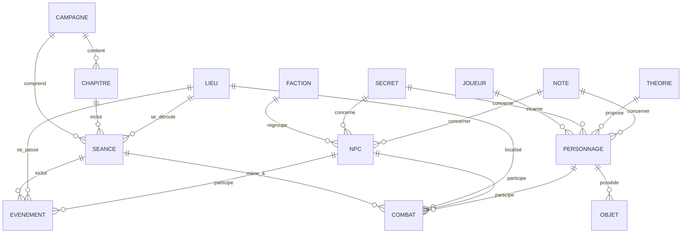
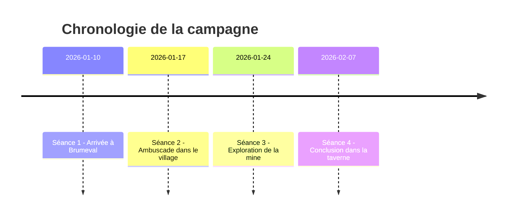

# Format d’import « Codex » de campagne (MJ)

**Résumé exécutif :**  
Pour importer une campagne dans l’assistant MJ, nous recommandons de fournir les données au format **YAML** ou **JSON**. YAML, conçue pour la lisibilité (indentation, commentaires, multi-lignes), est bien adaptée aux fichiers édités manuellement par le MJ. JSON, grâce à sa syntaxe stricte (accolades, guillemets) et à son vaste écosystème d’outillage, est idéal pour l’interopérabilité et la validation automatique. Le format YAML (superset de JSON) peut être validé par un **schéma JSON Schema**, puisqu’une grande partie du YAML est valide en JSON. Un schéma JSON Schema (par ex. Draft 2020-12) définira toutes les entités et leurs propriétés. Nous préconisons d’inclure un identifiant de version (p. ex. SemVer dans `$id` du schéma) pour gérer l’évolution du format. Le fichier importé devra être local (stockage disque) pour préserver la confidentialité. Des règles d’archivage (ex. `archivageSeances: 100`) peuvent être incluses pour isoler automatiquement les vieilles séances. Chaque entité (campagne, séance, PNJ, objet, etc.) possède un champ **id unique** servant de référence pour les mises à jour incrémentales (upsert) et évitant les doublons. 

| **Critère**       | **YAML** (lecture MJ)                              | **JSON** (interopérabilité)                        |
|-------------------|----------------------------------------------------|----------------------------------------------------|
| Lisibilité        | Syntaxe indentée, plus lisible (multi-lignes, *ancres*)  | Syntaxe stricte (accolades/quotes), moins naturelle pour un humain |
| Commentaires      | Pris en charge (`# commentaire`)  | Non (pas de syntaxe de commentaire standard)   |
| Structure         | Plus flexible (alias, multi-document), attention aux erreurs d’indentation | Rigoureux et compact, pas d’ambiguïté syntaxique    |
| Validation        | Moins d’outils natifs (mais JSON Schema peut valider YAML) | Large écosystème JSON Schema/Ajv, parsers rapides |
| Usage courant     | Configs et documentation (humains)    | APIs web, échanges de données (machines)  |

## Schéma de données (entités universelles)

Le fichier d’import regroupe les **entités universelles** suivantes. Chaque entité a des champs typés (chaîne, nombre, booléen, liste ou objet). Les clés sont écrites en _camelCase_ (ASCII alphanum.) conformément aux recommandations de nommage JSON (camelCase). Les entités clés et leurs champs importants sont :

- **Campagne** (objet principal) – *Champs requis* :  
  - `id` (string, identifiant unique), `titre` (string), `langue` (string, code IETF locale ex. `"fr-FR"`), `version` (string, ex. `"1.0"`).  
  - *Champs optionnels* : `description` (string), `auteur` (string), `dateDebut` (date ISO), `imageCouverture` (string, chemin image), `modules` (liste de strings, modules activés).  
  - *Contraintes* : `langue` au format `xx-YY`, `version` en SemVer recommandée.  
  - *Exemple* : `id: "camp1"`, `titre: "Les Brumes de Valdras"`, `langue: "fr-FR"`.

- **Chapitres** / **Arcs narratifs** (liste) – regroupe les séances thématiques.  
  - *Champs requis* : `id`, `titre`. *Optionnels* : `description`, `image`, `sessions` (liste d’IDs de séances).  
  - Exemple : `id: "chap1"`, `titre: "Prologue à Brumeval"`, `sessions: ["seance1","seance2"]`.

- **Séances** (liste) – chaque session de jeu.  
  - *Champs requis* : `id`, `date` (ISO), `titre`.  
  - *Optionnels* : `duree` (durée), `chapitreId` (ID du chapitre parent), `lieu` (ID de lieu principal), `personnages` (IDs de PJ présents), `evenements` (IDs d’événements notables), `combats` (IDs de combats), `secretsReveles` (IDs de secrets découverts), `resume` (texte résumé).  
  - Exemple : `id: "seance1"`, `date: "2026-01-10"`, `titre: "Arrivée à Brumeval"`, `personnages: ["PJ1","PJ2"]`.

- **Lieux** (liste) – emplacements géographiques ou salles.  
  - *Champs* : `id`, `nom`, `type` (ex. `"village"`, `"donnjon"`), `description`, `images` (liste de médias), `relations` (IDs de lieux voisins éventuels).  
  - Exemple : `id: "Brumeval"`, `nom: "Village de Brumeval"`, `type: "village"`.

- **PNJs** (liste) – personnages non-joueurs.  
  - *Champs* : `id`, `nom`, `role` (ex. “forgeron”, “maire”), `description`, `faction` (ID de faction affiliée), `image` (réf. média), `relations` (liste d’objets *{cible, type, valeur}* exprimant la confiance/méfiance ou autre).  
  - Exemple : `id: "Forgeron"`, `nom: "André"`, `role: "Forgeron"`, `description: "Grand et bourru"`, `faction: "F1"`.

- **Joueurs** et **Personnages** (PJ) – listes distinctes.  
  - Joueur : `id`, `nom` (string), `personnages` (liste d’IDs de ses PJs).  
  - Personnage : `id`, `nom`, `joueurId`, `classe`, `niveau`, `pointsVie`, `inventaire` (IDs d’objets possédés), `image` (ID média).  
  - Ex. Joueur `id: "J1"`, `nom: "Alice"`, `personnages: ["PJ1"]`. Personnage `id: "PJ1"`, `nom: "Anya l'éclaireuse"`, `joueurId: "J1"`, `classe: "Rôdeuse"`, `niveau: 3`.

- **Objets** (liste) – équipements ou artefacts.  
  - *Champs* : `id`, `nom`, `type` (ex. `"arme"`, `"document"`), `description`, `possesseur` (ID de PJ ou lieu), `image`.  
  - Ex. : `id: "I1"`, `nom: "Épée longue enchantée"`, `type: "arme"`, `possesseur: "PJ2"`.

- **Factions** (liste) – groupes sociaux ou organisations.  
  - *Champs* : `id`, `nom`, `description`, `alignement` (ex. `"neutre"`, `"mal"`), `membres` (liste d’IDs de PNJ ou PJ).  
  - Ex. : `id: "F1"`, `nom: "Habitants de Brumeval"`, `membres: ["Eldric","Maire"]`.

- **Secrets** (liste) – intrigues cachées.  
  - *Champs* : `id`, `titre`, `decouverte` (booléen), `description`, `participants` (IDs de PJ au courant).  
  - Ex. : `id: "secret1"`, `titre: "Mine hantée"`, `decouverte: true`, `description: "La mine est hantée..."`.

- **Événements** (liste) – faits marquants.  
  - *Champs* : `id`, `titre`, `description`, `date`, `lieu` (ID de lieu), `personnagesImpliques` (IDs de PNJ/PJ impliqués).  
  - Ex. : `id: "evenement1"`, `titre: "Attaque de bandits"`, `lieu: "Brumeval"`, `personnagesImpliques: ["CapitaineBandits"]`.

- **Combats** (liste) – affrontements.  
  - *Champs* : `id`, `titre`, `date`, `participants` (IDs de PNJ/PJ), `lieu`, `resultat`.  
  - Ex. : `id: "combat1"`, `titre: "Escarmouche à l'aube"`, `participants: ["PJ1","PJ2","CapitaineBandits"]`.

- **Médias/Images** (liste) – références de fichiers.  
  - *Champs* : `id`, `fichier` (chemin relatif, ex. `"images/scene.jpg"`), `caption` (texte alt).  
  - Ex. : `id: "imgMine"`, `fichier: "images/mine.jpg"`, `caption: "Entrée de la mine"`.

- **Relations** (liste) – relations arbitraires entre entités (PNJ–PNJ, lieu–lieu, etc.).  
  - *Champs* : `id`, `source`, `cible` (IDs), `type` (string), `valeur` (numérique).  
  - Ex. : `source: "Forgeron"`, `cible: "Maire"`, `type: "mefiance"`, `valeur: -2`.

- **Théories** (liste) – hypothèses des joueurs.  
  - *Champs* : `id`, `joueurId`, `texte` (string), `concerne` (ID ciblé).  
  - Ex. : `id: "th1"`, `joueurId: "J1"`, `texte: "Le forgeron cache quelque chose"`, `concerne: "Forgeron"`.

- **Notes** (liste) – mémo MJ libre.  
  - *Champs* : `id`, `date`, `auteur` (ex. `"MJ"`), `texte`.  
  - Ex. : `id: "note1"`, `auteur: "MJ"`, `texte: "Les PJ ont dévié..."`.

- **Paramètres & exports** – configuration de l’import.  
  - Dans `settings` ou racine : `langue` (ex. `"fr-FR"`), `archivageSeances` (nombre max avant archivage automatique), `modules` activés, `assistanceIA` (p.e. `"discret"`), etc.  
  - Ex. : `langue: "fr-FR"`, `archivageSeances: 100`.  
  - **Exports** : options d’export (booléens) pour PDF/Markdown.  
  - **Plugins** : liste d’objets `{id, version, active}` signalant les plugins chargés.

**Relations entre entités (diagramme MER)** : le schéma met en relation ces entités. Par exemple, une **Campagne** contient plusieurs **Chapitre** et **Séance** ; une **Séance** peut se dérouler dans un **Lieu**, impliquer des **PNJ**, **PJ**, **Événements** et **Combats** ; un **Faction** regroupe des **PNJ** ; un **PJ** possède des **Objets**, etc. Voici un diagramme ER simplifié (Mermaid) :  



#### Exemple de chronologie (Mermaid timeline) des séances

Pour visualiser la séquence des séances, on peut utiliser un **diagramme chronologique** Mermaid. Par exemple :  



## Exemples de fichier de campagne

Ci-dessous un exemple complet (fictif) de fichier **YAML** couvrant tous les champs cités (campagne « Les Brumes de Valdras »). On montre également l’équivalent **JSON**. Les IDs (ex. `id: "PJ1"`) servent de clés de référence pour les relations.  

```yaml
campagne:
  id: "camp1"
  titre: "Les Brumes de Valdras"
  description: "Une campagne mystérieuse dans le village de Brumeval"
  langue: "fr-FR"
  auteur: "MJ1"
  dateDebut: "2026-01-10"
  version: "1.0"
  modules:
    - Seances
    - PNJ
    - Secrets
    - Cartes
    - Preparation

chapitres:
  - id: "chap1"
    titre: "Prologue à Brumeval"
    description: "Introduction aux personnages et à l'ambiance du village."
    sessions: ["seance1", "seance2"]
  - id: "chap2"
    titre: "Forêt de Valdras"
    description: "Exploration de la forêt environnante et premier combat."
    sessions: ["seance3"]

seances:
  - id: "seance1"
    date: "2026-01-10"
    titre: "Arrivée à Brumeval"
    duree: "3h"
    chapitreId: "chap1"
    personnages: ["PJ1", "PJ2"]
    evenements: ["evenement1", "evenement2"]
    combats: []
    secretsReveles: []
    resume: "Les PJ arrivent au village et rencontrent l'aubergiste Eldric."
  - id: "seance2"
    date: "2026-01-17"
    titre: "Ambuscade dans le village"
    duree: "2h"
    chapitreId: "chap1"
    personnages: ["PJ1", "PJ2"]
    evenements: ["evenement3"]
    combats: ["combat1"]
    secretsReveles: ["secret1"]
    resume: "Les PJ sont attaqués par des bandits dans les rues."
  - id: "seance3"
    date: "2026-01-24"
    titre: "Exploration de la mine abandonnée"
    duree: "4h"
    chapitreId: "chap2"
    personnages: ["PJ1", "PJ2"]
    evenements: ["evenement4", "evenement5"]
    combats: []
    secretsReveles: ["secret2"]
    resume: "Les PJ explorent la mine et découvrent ses secrets."

lieux:
  - id: "Brumeval"
    nom: "Village de Brumeval"
    type: "village"
    description: "Un petit village au bord d'une forêt sombre."
    images: ["imgBrumeval"]
  - id: "Taverne"
    nom: "Taverne du Corbeau"
    type: "taverne"
    description: "Lieu de rassemblement des habitants, souvent des rumeurs y circulent."
    images: ["imgTaverne"]
  - id: "Forge"
    nom: "Forge du village"
    type: "atelier"
    description: "Forge du forgeron local, André le Maître-forgeron."
    images: ["imgForge"]
  - id: "Mine"
    nom: "Mine abandonnée"
    type: "ruine"
    description: "Mine hantée, au cœur des collines de Montval."
    images: ["imgMine"]

pnjs:
  - id: "Eldric"
    nom: "Eldric l'aubergiste"
    role: "Aubergiste"
    description: "Aubergiste jovial, très intéressé de vendre de l'hydromel."
    faction: "F1"
    relations:
      - cible: "Maire"
        type: "mefiance"
        valeur: -1
  - id: "Maire"
    nom: "Maire de Brumeval"
    role: "Maire"
    description: "Responsable du village, il semble nerveux et secret."
    faction: "F1"
    relations:
      - cible: "Eldric"
        type: "confiance"
        valeur: 1
      - cible: "F2"
        type: "complice"
        valeur: 2
  - id: "Forgeron"
    nom: "André le Maître-forgeron"
    role: "Forgeron"
    description: "Grand et bourru, il a la confiance du village."
    faction: "F1"
    relations:
      - cible: "Maire"
        type: "mefiance"
        valeur: -2
  - id: "CapitaineBandits"
    nom: "Capitaine Thorod"
    role: "Chef bandit"
    description: "Chef cruel du groupe de pillards."
    faction: "F2"
    relations:
      - cible: "Maire"
        type: "allie"
        valeur: 1

joueurs:
  - id: "J1"
    nom: "Alice"
    personnages: ["PJ1"]
  - id: "J2"
    nom: "Bob"
    personnages: ["PJ2"]

personnages:
  - id: "PJ1"
    nom: "Anya l'éclaireuse"
    joueurId: "J1"
    classe: "Rôdeuse"
    niveau: 3
    pointsVie: 25
    inventaire: ["I1","I2"]
  - id: "PJ2"
    nom: "Galdor le Guerrier"
    joueurId: "J2"
    classe: "Guerrier"
    niveau: 4
    pointsVie: 30
    inventaire: ["I3"]

objets:
  - id: "I1"
    nom: "Épée longue enchantée"
    type: "arme"
    description: "Une épée au fil enchanté, offre +2 en combat."
    possesseur: "PJ2"
    image: "imgEpee"
  - id: "I2"
    nom: "Carte du Montval"
    type: "document"
    description: "Carte ancienne menant à une caverne secrète."
    possesseur: "PJ1"
  - id: "I3"
    nom: "Talisman en argent"
    type: "amulette"
    description: "Protecteur contre les énergies occultes."
    possesseur: "PJ1"

factions:
  - id: "F1"
    nom: "Habitants de Brumeval"
    description: "Villageois loyaux, mais certains parlent de corruption."
    alignement: "neutre"
    membres: ["Eldric","Maire","Forgeron"]
  - id: "F2"
    nom: "Bandits de Montval"
    description: "Bande de pillards basée à Montval."
    alignement: "mal"
    membres: ["CapitaineBandits"]

secrets:
  - id: "secret1"
    titre: "Mine hantée"
    decouverte: true
    description: "La mine est hantée par des esprits étranges."
    participants: ["PJ1","PJ2"]
  - id: "secret2"
    titre: "Maire corrompu"
    decouverte: false
    description: "Le maire finance les bandits pour enrichir le village."

evenements:
  - id: "evenement1"
    titre: "Rencontre avec l'aubergiste"
    description: "Les PJ discutent avec Eldric dans la taverne."
    lieu: "Taverne"
    personnagesImpliques: ["Eldric"]
  - id: "evenement2"
    titre: "Rumeurs de la taverne"
    description: "Eldric mentionne des disparitions à la mine abandonnée."
    lieu: "Taverne"
    personnagesImpliques: ["Eldric","PJ1"]
  - id: "evenement3"
    titre: "Attaque de bandits"
    description: "Les PJ sont attaqués en plein jour par des bandits."
    lieu: "Brumeval"
    personnagesImpliques: ["CapitaineBandits"]
  - id: "evenement4"
    titre: "Découverte de l'épée"
    description: "Anya trouve une épée magique dans la mine."
    lieu: "Mine"
    personnagesImpliques: ["PJ2"]
  - id: "evenement5"
    titre: "Manifestation des esprits"
    description: "Des fantômes attaquent les PJ dans la mine."
    lieu: "Mine"
    personnagesImpliques: ["PJ1","PJ2"]

combats:
  - id: "combat1"
    titre: "Escarmouche à l'aube"
    date: "2026-01-18"
    participants: ["PJ1","PJ2","CapitaineBandits"]
    lieu: "Brumeval"
    resultat: "PJ1 étourdi, Capitaine tué"

images:
  - id: "imgBrumeval"
    fichier: "images/brumeval.jpg"
    caption: "Vue du village de Brumeval"
  - id: "imgTaverne"
    fichier: "images/taverne.jpg"
    caption: "Intérieur de la Taverne du Corbeau"
  - id: "imgForge"
    fichier: "images/forge.jpg"
    caption: "La forge d'André, le forgeron"
  - id: "imgMine"
    fichier: "images/mine.jpg"
    caption: "Entrée de la mine abandonnée"
  - id: "imgEpee"
    fichier: "images/epee.png"
    caption: "Épée longue enchantée"

relations:
  - id: "rel1"
    source: "Forgeron"
    cible: "Maire"
    type: "mefiance"
    valeur: -2
  - id: "rel2"
    source: "Forgeron"
    cible: "Eldric"
    type: "confiance"
    valeur: 2

theories:
  - id: "th1"
    joueurId: "J1"
    texte: "Je pense que le forgeron cache quelque chose."
    concerne: "Forgeron"
  - id: "th2"
    joueurId: "J2"
    texte: "Le maire est complice des bandits."
    concerne: "Maire"

notes:
  - id: "note1"
    date: "2026-01-15"
    auteur: "MJ"
    texte: "Les joueurs ont dévié vers la forêt sans raison apparente."
  - id: "note2"
    date: "2026-01-25"
    auteur: "MJ"
    texte: "Important: sauvegarder la foi des villageois."

exports:
  pdf: true
  markdown: true
  json: false

settings:
  langue: "fr-FR"
  assistanceIA: "discret"
  modules:
    PNJ: true
    Sessions: true
    Secrets: true
    Cartes: true
    Images: true
    Preparation: true
    Combat: false
  archivageSeances: 100

plugins:
  - id: "CartesPlugin"
    version: "0.9.1"
    active: true
  - id: "ExportPNG"
    version: "1.2.0"
    active: false
```

L’exemple JSON équivalent (converti) serait similaire, par exemple :  

```json
{
  "campagne": {
    "id": "camp1",
    "titre": "Les Brumes de Valdras",
    "description": "Une campagne mystérieuse dans le village de Brumeval",
    "langue": "fr-FR",
    "auteur": "MJ1",
    "dateDebut": "2026-01-10",
    "version": "1.0",
    "modules": ["Seances", "PNJ", "Secrets", "Cartes", "Preparation"]
  },
  "chapitres": [
    {
      "id": "chap1",
      "titre": "Prologue à Brumeval",
      "description": "Introduction aux personnages et à l'ambiance du village.",
      "sessions": ["seance1", "seance2"]
    },
    {
      "id": "chap2",
      "titre": "Forêt de Valdras",
      "description": "Exploration de la forêt environnante et premier combat.",
      "sessions": ["seance3"]
    }
  ],
  "seances": [
    {
      "id": "seance1",
      "date": "2026-01-10",
      "titre": "Arrivée à Brumeval",
      "duree": "3h",
      "chapitreId": "chap1",
      "personnages": ["PJ1", "PJ2"],
      "evenements": ["evenement1", "evenement2"],
      "combats": [],
      "secretsReveles": [],
      "resume": "Les PJ arrivent au village et rencontrent l'aubergiste Eldric."
    },
    {
      "id": "seance2",
      "date": "2026-01-17",
      "titre": "Ambuscade dans le village",
      "duree": "2h",
      "chapitreId": "chap1",
      "personnages": ["PJ1", "PJ2"],
      "evenements": ["evenement3"],
      "combats": ["combat1"],
      "secretsReveles": ["secret1"],
      "resume": "Les PJ sont attaqués par des bandits dans les rues."
    },
    {
      "id": "seance3",
      "date": "2026-01-24",
      "titre": "Exploration de la mine abandonnée",
      "duree": "4h",
      "chapitreId": "chap2",
      "personnages": ["PJ1", "PJ2"],
      "evenements": ["evenement4", "evenement5"],
      "combats": [],
      "secretsReveles": ["secret2"],
      "resume": "Les PJ explorent la mine et découvrent ses secrets."
    }
  ]
  /* ... (les autres entités similaires) ... */
}
```

## Instructions d’importation

- **Mapping des champs :** les clés YAML/JSON doivent correspondre exactement aux propriétés du schéma. Par défaut on n’essaie pas de deviner les alias : nom de champ identique (sensible à la casse).  
- **Clés uniques et doublons :** chaque entité importante (`id`) doit être unique. En cas de doublon lors de l’import, l’outil peut proposer de *mettre à jour* l’entité existante (upsert) plutôt que de créer un duplicata. Les imports doivent être idempotents : si `id` existe, on remplace ou on ignore.  
- **Mises à jour incrémentales :** pour ajouter des informations au fil du temps, l’importeur peut accepter des fichiers partiels (p.ex. nouvelle séance), ou des imports successifs. Un champ de version (`version` ou `schemaVersion`) peut indiquer si le fichier a changé depuis la dernière importation. On peut incrémenter le numéro de version pour chaque mise à jour majeure (cf. pratique `$id` avec SemVer).  
- **Localisation (FR) :** les textes (titres, descriptions) sont ici en français. On indique la langue globale dans `campagne.langue`. Pour gérer le multilingue, on peut étendre la structure (ex. suffixes `_fr`/`_en` sur certains champs) ou utiliser des fichiers de traduction séparés. Le choix du format JSON/YAML dépend aussi de qui l’édite : YAML est recommandé si le MJ modifie manuellement (support de commentaires, meilleure lisibilité). JSON, sans commentaire, est préférable quand le fichier est généré ou consommé par des outils externes.  
- **Versioning :** on peut intégrer le numéro de version de l’import (p. ex. `"1.0.0"`) dans le champ `campagne.version` ou comme `$id` du schéma JSON (voir [33]). Chaque nouveau format majeur pourra être validé par une nouvelle version de schéma.  
- **Validation :** utilisez **JSON Schema** pour vérifier la structure. Voici le schéma JSON Schema complet (Draft 2020-12) décrivant de manière exhaustive toutes les entités du Codex de campagne :

  ```json
  {
    "$schema": "https://json-schema.org/draft/2020-12/schema",
    "$id": "https://copilote-mj.org/schema/campagne-codex-v1.0.0.json",
    "title": "Schéma d'import de campagne (Codex)",
    "description": "Schéma complet de validation pour le format d'importation de campagne du Copilote MJ.",
    "type": "object",
    "properties": {
      "campagne": { "$ref": "#/$defs/campagne" },
      "chapitres": {
        "type": "array",
        "items": { "$ref": "#/$defs/chapitre" }
      },
      "seances": {
        "type": "array",
        "items": { "$ref": "#/$defs/seance" }
      },
      "lieux": {
        "type": "array",
        "items": { "$ref": "#/$defs/lieu" }
      },
      "pnjs": {
        "type": "array",
        "items": { "$ref": "#/$defs/pnj" }
      },
      "joueurs": {
        "type": "array",
        "items": { "$ref": "#/$defs/joueur" }
      },
      "personnages": {
        "type": "array",
        "items": { "$ref": "#/$defs/personnage" }
      },
      "objets": {
        "type": "array",
        "items": { "$ref": "#/$defs/objet" }
      },
      "factions": {
        "type": "array",
        "items": { "$ref": "#/$defs/faction" }
      },
      "secrets": {
        "type": "array",
        "items": { "$ref": "#/$defs/secret" }
      },
      "evenements": {
        "type": "array",
        "items": { "$ref": "#/$defs/evenement" }
      },
      "combats": {
        "type": "array",
        "items": { "$ref": "#/$defs/combat" }
      },
      "images": {
        "type": "array",
        "items": { "$ref": "#/$defs/media" }
      },
      "relations": {
        "type": "array",
        "items": { "$ref": "#/$defs/relation" }
      },
      "theories": {
        "type": "array",
        "items": { "$ref": "#/$defs/theorie" }
      },
      "notes": {
        "type": "array",
        "items": { "$ref": "#/$defs/note" }
      },
      "exports": { "$ref": "#/$defs/exports" },
      "settings": { "$ref": "#/$defs/settings" },
      "plugins": {
        "type": "array",
        "items": { "$ref": "#/$defs/plugin" }
      }
    },
    "required": ["campagne", "seances"],
    "additionalProperties": true,
    "$defs": {
      "campagne": {
        "type": "object",
        "properties": {
          "id": { "type": "string" },
          "titre": { "type": "string" },
          "description": { "type": "string" },
          "langue": { "type": "string", "pattern": "^[a-z]{2}-[A-Z]{2}$" },
          "auteur": { "type": "string" },
          "dateDebut": { "type": "string", "format": "date" },
          "version": { "type": "string", "pattern": "^[0-9]+\\.[0-9]+\\.[0-9]+$" },
          "modules": {
            "type": "array",
            "items": { "type": "string" }
          }
        },
        "required": ["id", "titre", "langue", "version"],
        "additionalProperties": false
      },
      "chapitre": {
        "type": "object",
        "properties": {
          "id": { "type": "string" },
          "titre": { "type": "string" },
          "description": { "type": "string" },
          "sessions": {
            "type": "array",
            "items": { "type": "string" }
          }
        },
        "required": ["id", "titre"],
        "additionalProperties": false
      },
      "seance": {
        "type": "object",
        "properties": {
          "id": { "type": "string" },
          "date": { "type": "string", "format": "date" },
          "titre": { "type": "string" },
          "duree": { "type": "string" },
          "chapitreId": { "type": "string" },
          "lieu": { "type": "string" },
          "personnages": {
            "type": "array",
            "items": { "type": "string" }
          },
          "evenements": {
            "type": "array",
            "items": { "type": "string" }
          },
          "combats": {
            "type": "array",
            "items": { "type": "string" }
          },
          "secretsReveles": {
            "type": "array",
            "items": { "type": "string" }
          },
          "resume": { "type": "string" }
        },
        "required": ["id", "date", "titre"],
        "additionalProperties": false
      },
      "lieu": {
        "type": "object",
        "properties": {
          "id": { "type": "string" },
          "nom": { "type": "string" },
          "type": { "type": "string" },
          "description": { "type": "string" },
          "images": {
            "type": "array",
            "items": { "type": "string" }
          },
          "relations": {
            "type": "array",
            "items": { "type": "string" }
          }
        },
        "required": ["id", "nom", "type"],
        "additionalProperties": false
      },
      "pnj": {
        "type": "object",
        "properties": {
          "id": { "type": "string" },
          "nom": { "type": "string" },
          "role": { "type": "string" },
          "description": { "type": "string" },
          "faction": { "type": "string" },
          "image": { "type": "string" },
          "relations": {
            "type": "array",
            "items": {
              "type": "object",
              "properties": {
                "cible": { "type": "string" },
                "type": { "type": "string" },
                "valeur": { "type": "integer" }
              },
              "required": ["cible", "type", "valeur"],
              "additionalProperties": false
            }
          }
        },
        "required": ["id", "nom", "role"],
        "additionalProperties": false
      },
      "joueur": {
        "type": "object",
        "properties": {
          "id": { "type": "string" },
          "nom": { "type": "string" },
          "personnages": {
            "type": "array",
            "items": { "type": "string" }
          }
        },
        "required": ["id", "nom"],
        "additionalProperties": false
      },
      "personnage": {
        "type": "object",
        "properties": {
          "id": { "type": "string" },
          "nom": { "type": "string" },
          "joueurId": { "type": "string" },
          "classe": { "type": "string" },
          "niveau": { "type": "integer", "minimum": 1 },
          "pointsVie": { "type": "integer", "minimum": 0 },
          "inventaire": {
            "type": "array",
            "items": { "type": "string" }
          },
          "image": { "type": "string" }
        },
        "required": ["id", "nom", "joueurId"],
        "additionalProperties": false
      },
      "objet": {
        "type": "object",
        "properties": {
          "id": { "type": "string" },
          "nom": { "type": "string" },
          "type": { "type": "string" },
          "description": { "type": "string" },
          "possesseur": { "type": "string" },
          "image": { "type": "string" }
        },
        "required": ["id", "nom", "type"],
        "additionalProperties": false
      },
      "faction": {
        "type": "object",
        "properties": {
          "id": { "type": "string" },
          "nom": { "type": "string" },
          "description": { "type": "string" },
          "alignement": { "type": "string" },
          "membres": {
            "type": "array",
            "items": { "type": "string" }
          }
        },
        "required": ["id", "nom"],
        "additionalProperties": false
      },
      "secret": {
        "type": "object",
        "properties": {
          "id": { "type": "string" },
          "titre": { "type": "string" },
          "decouverte": { "type": "boolean" },
          "description": { "type": "string" },
          "participants": {
            "type": "array",
            "items": { "type": "string" }
          }
        },
        "required": ["id", "titre", "decouverte"],
        "additionalProperties": false
      },
      "evenement": {
        "type": "object",
        "properties": {
          "id": { "type": "string" },
          "titre": { "type": "string" },
          "description": { "type": "string" },
          "date": { "type": "string", "format": "date" },
          "lieu": { "type": "string" },
          "personnagesImpliques": {
            "type": "array",
            "items": { "type": "string" }
          }
        },
        "required": ["id", "titre"],
        "additionalProperties": false
      },
      "combat": {
        "type": "object",
        "properties": {
          "id": { "type": "string" },
          "titre": { "type": "string" },
          "date": { "type": "string", "format": "date" },
          "participants": {
            "type": "array",
            "items": { "type": "string" }
          },
          "lieu": { "type": "string" },
          "resultat": { "type": "string" }
        },
        "required": ["id", "titre", "participants"],
        "additionalProperties": false
      },
      "media": {
        "type": "object",
        "properties": {
          "id": { "type": "string" },
          "fichier": { "type": "string" },
          "caption": { "type": "string" }
        },
        "required": ["id", "fichier"],
        "additionalProperties": false
      },
      "relation": {
        "type": "object",
        "properties": {
          "id": { "type": "string" },
          "source": { "type": "string" },
          "cible": { "type": "string" },
          "type": { "type": "string" },
          "valeur": { "type": "integer" }
        },
        "required": ["id", "source", "cible", "type", "valeur"],
        "additionalProperties": false
      },
      "theorie": {
        "type": "object",
        "properties": {
          "id": { "type": "string" },
          "joueurId": { "type": "string" },
          "texte": { "type": "string" },
          "concerne": { "type": "string" }
        },
        "required": ["id", "joueurId", "texte"],
        "additionalProperties": false
      },
      "note": {
        "type": "object",
        "properties": {
          "id": { "type": "string" },
          "date": { "type": "string", "format": "date" },
          "auteur": { "type": "string" },
          "texte": { "type": "string" }
        },
        "required": ["id", "auteur", "texte"],
        "additionalProperties": false
      },
      "exports": {
        "type": "object",
        "properties": {
          "pdf": { "type": "boolean" },
          "markdown": { "type": "boolean" },
          "json": { "type": "boolean" }
        },
        "required": ["pdf", "markdown", "json"],
        "additionalProperties": false
      },
      "settings": {
        "type": "object",
        "properties": {
          "langue": { "type": "string", "pattern": "^[a-z]{2}-[A-Z]{2}$" },
          "assistanceIA": { "type": "string", "enum": ["discret", "assiste", "desactive"] },
          "modules": {
            "type": "object",
            "properties": {
              "PNJ": { "type": "boolean" },
              "Sessions": { "type": "boolean" },
              "Secrets": { "type": "boolean" },
              "Cartes": { "type": "boolean" },
              "Images": { "type": "boolean" },
              "Preparation": { "type": "boolean" },
              "Combat": { "type": "boolean" }
            },
            "additionalProperties": false
          },
          "archivageSeances": { "type": "integer", "minimum": 10 }
        },
        "required": ["langue", "assistanceIA", "modules", "archivageSeances"],
        "additionalProperties": false
      },
      "plugin": {
        "type": "object",
        "properties": {
          "id": { "type": "string" },
          "version": { "type": "string", "pattern": "^[0-9]+\\.[0-9]+\\.[0-9]+$" },
          "active": { "type": "boolean" }
        },
        "required": ["id", "version", "active"],
        "additionalProperties": false
      }
    }
  }
  ```

  Ce schéma JSON garantit que toutes les entités du Codex de campagne sont modélisées de façon cohérente, typée et réutilisable via `$ref`.

- **Intégrité Référentielle (Clés Étrangères) :** 
  L'importateur doit valider les relations logiques pour éviter les données orphelines (ex. clés d'identifiants pointant vers le vide) :
  1. **Sessions / Chapitres :** Tout `chapitreId` ou ID dans `sessions` de chapitre doit correspondre à une séance existante.
  2. **Personnages / Joueurs :** Chaque personnage doit posséder un `joueurId` valide existant dans la liste `joueurs`.
  3. **Objets / Possesseurs :** Le champ `possesseur` d'un objet doit référencer soit l'ID d'un personnage, soit l'ID d'un lieu valide.
  4. **Relations :** Les champs `source` et `cible` d'une relation doivent référencer des identifiants valides existants (PNJ, PJ, ou faction).
  5. **Médias / Fichiers :** Toute référence visuelle (ex: `image`, `images`) doit renvoyer vers l'ID d'un média défini dans `images`.

- **Gestion des Conflits d'Identifiants (ID) :**
  Puisque l'application fonctionne par synchronisation incrémentale, l'import de données existantes peut générer des collisions d'ID. L'importateur doit suivre le comportement suivant :
  * **Option 1 : Écrasement (Upsert) [Par défaut]** : Si l'ID importé correspond à une entité déjà présente en base locale, l'entité locale est entièrement remplacée par la version importée.
  * **Option 2 : Fusion Inteligente (Merge)** : Utile pour les entités complexes (ex: fiches PNJ ou campagnes). L'importateur fusionne les données : les tableaux de relations ou d'inventaires sont combinés en supprimant les doublons, et pour les champs simples, la valeur la plus récente ou la plus complète est conservée.
  * **Option 3 : Ignorer** : Si l'entité existe déjà localement, le document importé est ignoré pour cette entité afin de protéger les modifications directes du MJ en cours de partie.
  * **Option 4 : Duplication avec Suffixe** : Génération d'un nouvel identifiant unique (ex: `Forgeron_import_1`) pour conserver à la fois l'ancienne et la nouvelle entité en base de données.

- **Gestion des Versions et Migration :**
  Le fichier d'importation contient une version dans `campagne.version` (au format SemVer). L'importateur implémente les règles suivantes :
  * **Compatibilité ascendante :** Une application dans une version récente doit accepter les formats d'importation plus anciens en appliquant des scripts de migration internes à la volée.
  * **Alerte de version future :** Si le fichier importé indique une version supérieure à celle prise en charge par l'application (ex: import en 2.0.0 sur une appli en 1.2.0), l'import est suspendu et une alerte invite l'utilisateur à mettre à jour son Copilote MJ.

- **Commandes d'import (exemples d'intégration dans des CLI ou scripts) :**
  ```bash
  # Importation standard d'une campagne complète avec validation de schéma
  copilote-mj import --file=campagne.yaml --validate-schema=true

  # Importation incrémentale d'une séance avec stratégie de fusion en cas de conflit d'ID
  copilote-mj import --file=seance_3.json --conflict-strategy=merge

  # Validation seule du fichier d'importation sans écriture en base de données
  copilote-mj validate --file=campagne.yaml
  ```


## Bonnes pratiques MJ

- **Nommage :** utilisez des noms de clés cohérents (camelCase) et en français pour la lisibilité. Pas d’espaces ni de caractères spéciaux.  
- **Structure de fichiers médias :** placez le fichier YAML/JSON au niveau racine du dossier de campagne, et stockez les images dans un sous-dossier (`images/`). Référencez-les par chemins relatifs (ex. `images/entree_mine.png`) afin que l’import reste portable. Par exemple, si le fichier `codex.yml` et les images sont dans le même dossier, les chemins relatifs suffisent.  
- **Stockage local :** toutes les données (y compris images) doivent rester sur l’appareil local (PC ou Android). Évitez les liens vers des ressources en ligne ou chemins absolus (cela pose des problèmes de portabilité et de permissions).  
- **Archiver régulièrement :** pour de longues campagnes, définissez un seuil dans `archivageSeances`. Par exemple, après 100 séances, le MJ peut décider de déplacer les anciennes séances dans un fichier séparé pour alléger le fichier courant. Cela correspond à une *stratégie d’archivage* permettant de conserver l’historique tout en gardant le fichier principal gérable.  
- **Sauvegarde et export :** encouragez le MJ à sauvegarder fréquemment le fichier d’import. Les données sensibles (détails privés) ne doivent pas être diffusées ; par défaut, les exports (PDF/MD) peuvent anonymiser certains détails si nécessaire.

## Variantes légère vs avancée

- **Import minimaliste :** ne fournir que l’essentiel – ex. `campagne` (titre, langue), les `seances` avec date et résumé minimal, les `pnjs` principaux (nom et rôle), les `pj` avec noms, et quelques `lieux`. Utile pour tester rapidement ou pour MJ débutant.  
- **Import complet (avancé) :** inclure toutes les entités détaillées – inventaire complet des objets, descriptions riches, images, relations/factions, secrets/événements compilés, notes détaillées, etc. Convient pour MJ expert souhaitant charger un univers complet dès le départ.  

L’importeur doit pouvoir gérer ces variantes (par exemple, tolérer des listes vides ou des entités absentes) sans planter, tant que les champs requis du schéma sont présents.

---

**Sources :** Specifications JSON Schema et OpenAPI, recommandations JSON:API pour le nommage, comparatifs YAML vs JSON, guide i18n sur YAML/JSON, validation JSON Schema de YAML, forums sur les chemins relatifs. Ces références confirment la faisabilité et guident la conception du format.