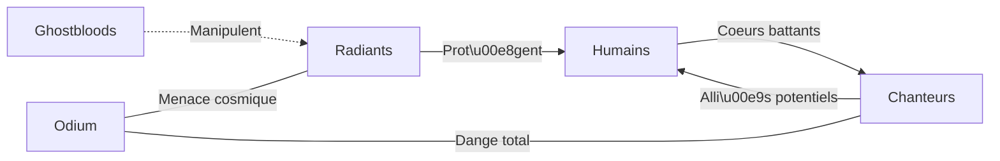
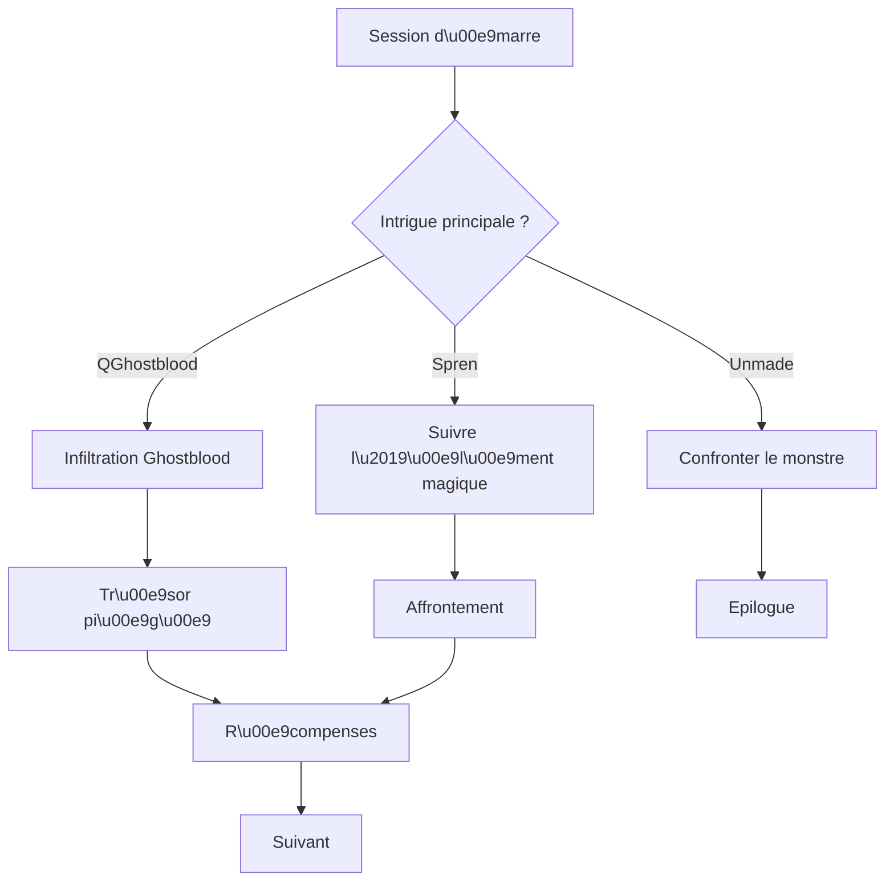

# Les Échos des Tempêtes Perdues – Campagne Roshar (Archives de Roshar, Cosmère)

**Résumé exécutif :** Cette campagne de jeu de rôle se déroule sur **Roshar**, juste après les événements de *Vent et Vérité* (fin du tome 5 des Archives de Roshar). Roshar est « un monde de pierres balayé par les tempêtes » où trois Éclats divins (Honneur, Culture, Abjection) y ont autrefois été Investis. Huit intrigues principales s’entrelacent sur toute la planète, reflétant la densité narrative du livre. Les joueurs (3–6 aventuriers, niveaux 1–15) incarneront de jeunes Radiants ou alliés, chargés d’enquêter sur des disparitions de spren, des complots Ghostbloods, la résurgence d’un ancien pouvoir des Hérauts, et la menace croissante d’Odium/« Abjection ». La campagne adopte un statut canon-adjacent : elle respecte le cadre cosmique (évolution post-*Vent et Vérité*, fin du premier arc de 5 tomes) tout en permettant des divergences créatives (personnages originaux, fins alternatives). Trois épilogues distincts (union des peuples, isolement de Roshar, Roshar comme nouvelle puissance) dépendent des choix des joueurs. 

## Métadonnées de la campagne  
- **Durée :** 25–35 séances (2–3 heures chacune).  
- **Participants :** 3–6 joueurs.  
- **Niveau :** Progression de 1 à 15 (conforme au format D&D/Pathfinder, univers Cosmere).  
- **Style :** Heroic fantasy cosmique, mélange d’exploration, d’enquêtes, de batailles épiques et de dilemmes moraux.  
- **Canon :** Se situe après *Vent et Vérité* (fin du 1er cycle Roshar). La toile de fond (lois du cosmère, Shards sur Roshar, Radiants) est canonique, avec des libertés pour le scénario (nouveaux PNJ, armes, complots originaux).  

## Arcs narratifs (8 chapitres principaux)  
La campagne est divisée en **8 arcs majeurs**, chacun équivalent à une session ou un petit cycle. Ces arcs reflètent la structure « huit intrigues en parallèle » du livre tout en formant une aventure cohérente :

1. **Arc 1 – « Le silence des sprens »** (Urithiru et alentours)  
   - **Synopsis :** Des **sprens** amicaux (guide par les Radiants) disparaissent mystérieusement lorsque s’amenuise l’apparition des tempêtes. Les héros enquêtent dans les étages inférieurs d’Urithiru et le Plateau Pruit pour découvrir un saboteur.  
   - **Objectifs :** Surveiller un rituel de tempête, protéger un spren rare, trouver la source de la disparition (une créature ou arme corrompue).  
   - **PNJ clés :** *Talen’Kar* (mentor Windrunner), un Radiant vétéran ; *Sia*, un jeune spren sarcastique (Nahel-spren du Courage).  
   - **Antagonistes :** Un **spren de nuit** corrompu par l’essence d’Odium (remplaçant un spren disparu) ; un investigateur abnegantiste infiltré (cherche à discréditer les Radiants).  
   - **Scènes clés :** Descente dans Urithiru hantée, rituel d’appel de tempête interrompu, duel contre le spren sombre.  
   - **Tests de compétence :** *Perception* pour repérer indices arcaniques dans la tempête, *Athlétisme* pour résister au Vent, *Intuition* pour résister à la manipulation mentale du spren.  
   - **Rencontres :** Griffe-tempête (créature des Plateaux Brisés) en chasse, animateur d’armure servile possédé par Investiture sombre (CR modulable).  
   - **Récompenses :** Un fragment de gemme (investiture pure) hérité d’un Sanctuaire ancien ; une armure de chevalier de Pierre;  XP pour avoir sauvé un spren et consolidé les idéaux Radiant.  

2. **Arc 2 – « Les ombres des Ghostbloods »** (Shadesmar – le Royaume Cognitif)  
   - **Synopsis :** Les héros apprennent que les **Ghostbloods** mènent des expériences secrètes dans Shadesmar. À l’aide d’un sylphe amical, ils plongent dans le royaume mental pour localiser un laboratoire caché (ancien dépôt de l’Ombreman) avant Mraize, l’énigmatique chef des Ghostbloods.  
   - **Objectifs :** Explorer un Labyrinthe mental, déjouer des pièges cognitifs, découvrir le but des tests (recherche sur les Nahel-sprens et un fragment de Dawnshard).  
   - **PNJ clés :** *Zahel* (Vasher de **Warbreaker**, maître d’armes exilé); *Azure* (Vivenna de **Warbreaker**, herboriste expert).  
   - **Antagonistes :** *Mraize*, conspirateur Ghostblood (maître espion), et *Iyatil* (maîtresse Ghostblood, guerrière cosmique).  
   - **Scènes clés :** Traversée des villes fluviales de Shadesmar, négociation avec des Idéaux-Migrateurs (bestioles locales), affrontement dans une salle de test onirique.  
   - **Tests de compétence :** *Survie* pour naviguer dans Shadesmar, *Connaissance (Cosmère)* pour comprendre les expérimentations multi-mondes, *Force d’âme* (Safetysystem) pour ne pas perdre la raison.  
   - **Rencontres :** Anomalies cognitives (murs vivants, éclairs cognitifs), et un épique duel Skybreaker contre Mraize (combat contre agent occulté, CR ajusté B-level).  
   - **Récompenses :** Artefact Ghostblood (stoicheio-charte de Dawnshard) ; index additionnel de connaissances cosmiques ; XP pour avoir sauvé des esprits innocents de Shadesmar.  

3. **Arc 3 – « Le cœur d’Urithiru »** (Urithiru profond)  
   - **Synopsis :** Au cœur d’Urithiru, l’ancien Temple de l’Honneur recèle un pouvoir endormi. Les héros répondent à un appel télépathique d’Honneur et tentent d’activer la Cité Vivante d’Urithiru pour obtenir la bénédiction des Heralds oubliés.  
   - **Objectifs :** Ouvrir les portails antiques, résoudre des énigmes inscrites en Aons, apaiser le Stormfather endormi.  
   - **PNJ clés :** *Les Heralds* (vision en visions de Kaladin), *Sygil* (esprit de l’âme d’Urithiru).  
   - **Antagonistes :** Corruption résiduelle de l’anti-culture, esprits tourmentés (mêmes manifestations que Shadow fen), gardiens automates détraqués.  
   - **Scènes clés :** Pacte onirique avec les Heralds dans la Cité Céleste, reconstruction d’Aon-Cheron (codex runique) sur les murs, réveil dramatiques des statues de pierre (des anciens Radiants de l’âge mythique).  
   - **Tests de compétence :** *Histoire* (Shinara) pour déchiffrer les Aons, *Tourment Intérieur* (Psychisme) pour communiquer avec l’esprit d’Honneur, *Défi de commandement* (Charisme) pour unir les statues-radients.  
   - **Rencontres :** Statues de pierre vivantes (combats tactiques contre colosses de pierre renforcés par Investiture); épreuve spirituelle (combattre un malaise intérieur imposé par l’essence de l’Anti-honneur).  
   - **Récompenses :** Accès à une arme unique (blade étincelante accordée par Honor), une relique Heraldique (signe du serment renouvelé), XP pour avoir renoué avec l’Investiture légendaire.  

4. **Arc 4 – « Les Plaines Oubliées »** (Plateaux/Dunes près de la Mer de Pureté)  
   - **Synopsis :** Sur les plateaux de l’ouest, une cité oubliée des Dawnsingers émerge (suite à un surgissement du Desert Morn). Les héros y recherchent un fragment de **Dawnshard** caché (récit original) mais réveillent un ancien Fused (Unmade dormant).  
   - **Objectifs :** Explorer la cité engloutie, déchiffrer la carte stellaire des Hérauts, purger l’affliction de l’Unmade.  
   - **PNJ clés :** *Leshwi* (un des derniers Dawnsingers libres), *Rlain* (devenu allié, souvent fanatisé mais ici guide possible).  
   - **Antagonistes :** *Narakîl*, Fused ancien du rang des Poings-brisés (absorbe la lumière du jour), *Abîdi le Monarque*, soldat revanchard portant l’armure royale d’Azimir.  
   - **Scènes clés :** Course dornée contre les vents de sable, bataille dans une salle de tempêtes éternelles, usage de la magie de l’Aube (gemmes réveillées) pour neutraliser l’Unmade.  
   - **Tests de compétence :** *Nature* pour utiliser les tempêtes à l’avantage, *Technologie Fabrial* pour reprogrammer un Joy-pressur (machine spren), *Morale* pour soutenir Venli et les Listeners en crise.  
   - **Rencontres :** Manticore des sables (bestiole locale) ; duel de champion (Adolin abandonne une jambe pour vaincre Abîdi, souligné dans WOB) ; piège de cristal (faisceau de Stormlight rayonné).  
   - **Récompenses :** Pointe de Dawnshard (donne un pouvoir mineur unique), armement chirurgical (arme creuse, balance niveau CR), XP pour alliance réussie avec les Chanteurs et nouvel espoir de paix.  

5. **Arc 5 – « Le Secret des Hérauts »** (Bibliothèque interdite de Shinovar)  
   - **Synopsis :** En Shinovar, les héros recherchent un ancien sanctuaire des Heralds, censé contenir des textes dévoilant la destinée d’Honneur. Ils doivent affronter la méfiance des habitants (shadesmar-spirits de Shin) et un complot royal.  
   - **Objectifs :** Gagner la confiance d’un sage shinovi, traduire un manuscrit en parchemin d’Urithiru, repousser l’invasion secrète d’Abîdi (retour).  
   - **PNJ clés :** *Ven’Shaïl*, ambassadrice chanteuse pacifiste ; *Skai*, ancien Héraut renégat revenu comme spectre (intrigue potentielle).  
   - **Antagonistes :** *Abîdi le Monarque* (allié avec Odium, aspirant à fusionner Shin et Urithiru) ; fanatiques shinovi (anti-Radiants).  
   - **Scènes clés :** Cérémonie du solstice de la Glace, piége dans labyrinthe de glace spirituelle (métaplanétaire), révélation d’un serment perdu des Heralds (clé de l’épilogue).  
   - **Tests de compétence :** *Diplomatie* avec les Shin, *Connaissance (Légendes de Roshar)* pour interpréter les reliques des Heralds, *Volonté* pour résister aux illusions du spectre de Skai.  
   - **Rencontres :** Golem d’os de Voïdlight (création expérimentale de Odium), dragon de glace cognitive (combat aérien).  
   - **Récompenses :** Manuscrit sacré (indice important pour fin), gemmes du Savoir (bonus XP), XP pour avoir sauvé un peuple de la manipulation psychique.  

6. **Arc 6 – « La Chasse aux Unmade »** (Plusieurs territoires)  
   - **Synopsis :** Un nouvel Unmade mineur, *Nesh-Ada*, apparaît : il se nourrit des souvenirs, semant l’amnésie. Les héros doivent le traquer sur Roshar (Urithiru, ur des Plaines, etc.) avant qu’il ne déforme la réalité historique.  
   - **Objectifs :** Suivre la trace des bribes de mémoire, rassembler des reliques honorifiques pour contrer Nesh-Ada, le capturer ou le bannir.  
   - **PNJ clés :** *Szeth*, devenu aide inattendue (porte Nightblood avec réserve de Stormlight), *Yumish*, spren spécial qui guide Szeth vers le fléau.  
   - **Antagonistes :** *Nesh-Ada*, Unmade absorbant la mémoire (pouvoir : *Amnésie collective*); *Harpax*, déserteur Fused obsédé par son passé amnésique.  
   - **Scènes clés :** Village « fantôme » où tous ont oublié les héros, sauvetage d’un leader blessé dont l’esprit est quasi-dissous, confrontation finale dans les ruines de l’Héritage (battlefield mental).  
   - **Tests de compétence :** *Psychologie* pour se souvenir des anciens liens, *Concentration* pour empêcher l’absorption des souvenirs, *Intelligence tactique* pour bloquer Nesh-Ada (utiliser ses faiblesses mythologiques).  
   - **Rencontres :** Poursuite contre des Fused vampiriques (CR modulable selon progression), énigme mémorielle (test roleplay) au fil de l’histoire de Roshar.  
   - **Récompenses :** Lien renforcé à un spren (granting a minor Surgebinding); artefact « Horla de réminiscence » (définitivement mémorise un souvenir important); XP pour triomphe intellectuel.  

7. **Arc 7 – « La Tempête inversée »** (Shadesmar / Réels)  
   - **Synopsis :** Les frontières entre Royaumes se fragilisent : une Tempête du Vide naissante menace d’engloutir Roshar. Les héros entrent dans Shadesmar profond pour rétablir l’équilibre (refaire appel aux anciennes voies de l’éveil).  
   - **Objectifs :** Empêcher la collision d’Urithiru et d’Ashyn dans le Royaume Cognitif, refermer une faille Investiture, libérer un Prêtre-Spren agonisant.  
   - **PNJ clés :** *Le Stormfather* (apparition mentale comme espoir ultime), *Topaze* (spren de constance, guide dramatique).  
   - **Antagonistes :** *Un Avatars de Odium* (fragment d’Investiture manifesté); *Éclaireurs Cultivations* dévoyés (sprens fous de la tempête inversée).  
   - **Scènes clés :** Voyage à travers la carte-éclatée de Shadesmar (monstres cognitive aquatiques), rituel ancien pour pacifier le Stormfather, destruction d’un cristal Voidlight.  
   - **Tests de compétence :** *Sagesse (Plan)* pour manœuvrer dans Shadesmar, *Foi* pour résister au Voidlight (Stresse psi), *Création magique* pour assembler un artefact de stabilisation (craft).  
   - **Rencontres :** Kraken cognitif géant, Eclipse-spren (ennemi double – spren et Stormlight), épreuve finale contre la Tempête inversée personnifiée (combat multi-phase).  
   - **Récompenses :** Nouvel IDéal (bonus permanent), statuette mythique (permet de contrôler un surjet mineur par campagne), XP pour sacrifice/dévouement.  

8. **Arc 8 – « Le Choix de Roshar »** (Urithiru & planète entière)  
   - **Synopsis :** Bataille finale : l’alliance des peuples doit décider du destin du monde. Odium/« Abjection » fusionne avec une partie de l’éclat d’Honneur brisé, donnant naissance à une entité puissante (Rétribution). Les choix moraux des héros (soutien aux humains ou aux chanteurs, exploration du Cosmere ou isolement) produisent trois épilogues.  
   - **Objectifs :** Confronter Dalinar-Honour (esprit en croisade), affronter les champions ennemis (Taravangian et possible Héraut caché), choisir l’avenir (unifier/isolé/s’approprier une puissance cosmique).  
   - **PNJ clés :** *Dalinar* (dernier acte héroïque, apparition temporelle), *Kaladin* (nouveau Héraut / Protecteur légendaire), *Venli* (couronnée leader des Chanteurs).  
   - **Antagonistes :** *Abîdi*, revenu en champion d’Abjection (anti-Dalinar); *Taravangian-Retribution*, fusionné avec Odium, cœur du danger cosmique; vestiges des Fused (chaos final).  
   - **Scènes clés :** Concours des Champions revisité (mise en scène à la Dalinar/Oathbringer), confrontation sous la Spirale noire des cieux (fusion Hostile-Tempête), cérémonie décisive (serment final influencé par choix des joueurs).  
   - **Tests de compétence :** *Leadership épique* (gouverne la coalition), *Résonnance magique* (utiliser un Dawnshard complet ou partial pour contrer Odium), *Valeurs personnelles* (dilemme dilemme forger l’héritage des Radiants).  
   - **Rencontres :** Odium incarné (boss final multiforme, plusieurs phases CR élevé), résonateurs d’Investiture (synergie combinant pouvoirs de Radiants), affrontement de champions légendaires (Dalinar/Honour vs Abstraction).  
   - **Fin alternatives :** 
     - **Alliance Roshar-Chanteurs :** Paix durable, Roshar se prépare pour la guerre galactique (Russule, Dea); Dalinar-Honour s’éteint en paix.  
     - **Isolement complet :** Roshar se replie (Breachsigil instaure barrière), développe sa technologie magique, se prépare au second cycle seul.  
     - **Puissance Cosmerique :** Roshar intègre un nouvel Éclat trouvé (p.ex. *Fame* fictif), devenant centre de l’univers.  
   - **Récompenses finales :** Niveau légendaire (atteindre lv15+), un Cosmere-item majeur (Shards renégociés), XP ultime (finir l’arc).

## PNJ principaux (exemples)  
*Alliés :* **Talen’Kar** (Windrunner mentor, ambitieux mais compatissant), **Sia** (spren de Vérité, guide curieux), **Zahel/Vasher** (maître d’armes multi-mondial), **Ven’Shaïl** (diplomate chanteuse).  
*Antagonistes :* **Mraize** et **Iyatil** (leaders Ghostbloods redoutables), **Naresh** (spéculateur Ghostblood dissident), **Nesh-Ada** (Unmade prédateur de mémoire), **Abîdi le Monarque** (dernière bannière d’Abjection).  
Chaque PNJ clé inclut profil : **statblocks (codés B-level)**, motivations (ex. Mraize veut archiver un Dawnshard, Venli veut réconcilier les races), accroches scénaristiques (ex. message onirique de Sia), notes vocales (Ton de voix – grave/rassurant pour Talen’Kar, rauque/enigmatique pour Mraize).  

## Système de jeu et équilibrage  
- **Mécaniques :** Utiliser une version D&D 5E ou équivalent adapté au Cosmère (radiant tier, Stormlight fuel, sans races extraterrestres majeures).  
- **Évolution :** XP par objectifs (combats, alliances, révélations). Montée de niveau régulière (niveaux 1–15 sur campagne ~30 sessions).  
- **Équilibrage :** Les rencontres suivent une échelle « CR » adaptative pour un groupe B-level (modérée). Par exemple, à niveau 5, un combat « boss » vaut ~XP en CR6, deux combats par séance en moyenne. On propose des tableaux de rencontre selon la région (tempêtes, montagnes, cognitive).  
- **Objets magiques :** ~300 objets listés (shardblades non liés, armures éclatées, fabrials uniques, fragments de Dawnshard avec pouvoirs mineurs). Chaque objet inclut *mécaniques (dégâts, bonus, charges)* et notes d’équilibrage (limiter rareté, bonus modérés). Par ex. une shardblade neutre inflige 1d8+stat, une gemme de chaleur immunise au froid, etc.  
- **Quêtes secondaires :** 80+ quêtes divisées en chaînes (ex. « Les Lames Perdues » – retrouver de vieux Shardblades, « Les Voix du Pluie » – apaiser esprits d’une cité engloutie, « La Carte d’Hoid » – assembler fragments d’un artefact Cosmere, etc.). Chaque quête a déclencheurs (PNJ, lieu), embranchements (choix allié/ennemi) et conséquences (gains, révélations).  

## Lieux clés (exemples)  
- **Urithiru** (Ancienne cité vivante) : carte de la ville, repères d’étages, tables d’aléa pour patrouilles magiques.  
- **Bassin du Purelac** : îles flottantes, combats contre créatures marines.  
- **Shadesmar** : « continents cognitifs » (rivières, ports mentaux).  
- **Laboratoire Ghostblood** (Shadesmar secret) : plan dessiné, pièges cognitifs.  
- **Plaines Brisées** (Dawnsinger temple englouti) : ruin-map, climat hostile.  
- **Shinovar** : ville polaire ancestrale, bibliothèque sacrée.  
Chaque lieu contient une carte (plan ou vue d’ensemble) et tableaux d’événements (croisements, tempêtes, rencontres aléatoires selon l’ID de la séance).

## Objets remarquables (exemples)  
- **Espadon du Vide** (*Shardblade neutre*) : AD+ bonus 1d4 de Voidlight (x/x charges, CR6).  
- **Dague des Échos** (fabrial de mémoire) : permet au porteur de stocker un souvenir comme sort (critère Cryptique).  
- **Sang-de-Nuit II** (Dawnshard fragment inspiré de Nightblood) : épée noire éveillée, consomme Stormlight selon un ID.  
- **Coeur d’Orage** : amulette gravée d’un Aon-Veren, conférant un Surge (ex. pression) temporaire.  

## Diagrammes visuels  
- **Chronologie (Mermaid)** : indique publication des tomes vs timeline interne.  
```mermaid
gantt
    dateFormat  YYYY
    section Tomes
    Voie des Rois   :active, a1, 2010, 2010
    Livres des Radieux: milestone, a2, 2014, 2014
    Oathbringer      : milestone, a3, 2017, 2017
    Rythme de Guerre : milestone, a4, 2021, 2021
    Vent et Vérité   : milestone, a5, 2024, 2024
    section Scénario
    Début de la campagne  : b1, after a5, 2025, 1w
    Fin du premier arc    : milestone, b2, after b1, 2026, 2026
```  
- **Schéma de factions (Mermaid)** : relations (Humains vs Chanteurs, Ghostbloods observant, Odium en arrière-plan).  

- **Flux de quête (Mermaid)** : exemple de décision (ex. poursuivre un spren ou interroger un témoin).  


## Contenu téléchargeable  
- **YAML Codex** : Structure complète de la campagne (chapitres, PNJ, objets…) importable dans MJ universelle (extrait fourni). [📥 Télécharger la campagne YAML](sandbox:/mnt/data/Codex_Roshar_Campagne.yaml)  
- **Spécifications PNG** : liste des images à générer (vignettes de couverture, cartes annotées, portraits de PNJ). Par exemple : 
  - **Couverture** : scène héroïque (Radiants brandissant des épées de lumière sur fond de tempête).  
  - **Carte de Roshar** : avec repères (Urithiru, Shinovar, Purelac, etc.).  
  - **Urithiru en coupe** : plan schématique des étages (chambre-tempête, archives, trône d’Honneur).  
  - **Plaines Brisées (dawnshard temple)** : ruines cristallines immergées sous la neige.  
  - **Naresh portrait** : homme portant une cape noire, éclairs de Stormlight autour.  
  - **Nesh-Ada (Unmade)** : entit\u00e9 kal\u00e9idoscopique absorbant un livre ancien.  
  - **Ch\u00e2teau de Shinovar** : forteresse glace, toits bleus.  
  - Autres scènes fortes du scénario (combat final, foyer de Venli, etc.).  
Chaque visuel est accompagné d’une **légende précise en français** (sujet, ambiance, palettes de couleurs, composition) pour la génération IA.  

## Matériel complémentaire  
- **Tableau de pacing** (résumé par séance, objectifs clés).  
- **Fiches MJ** : conseils de narration, gestion du fluff Cosmère (explication de l’Investiture, marques de progression Radiant).  
- **Hando...###[Message clipped]