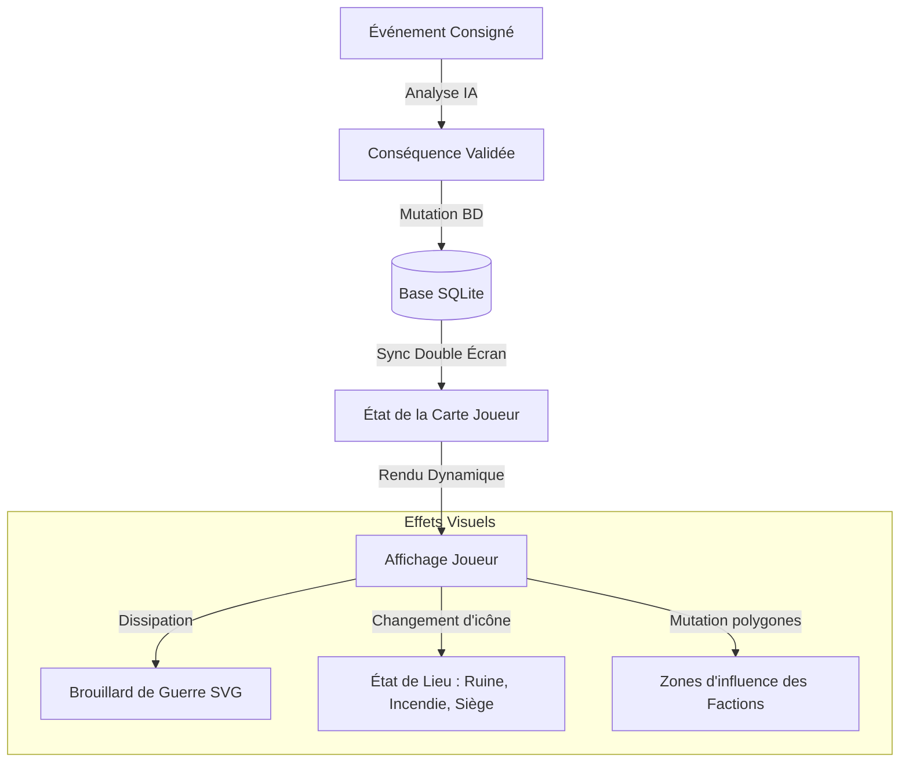

# Étude d'Architecture : Carte Interactive Évolutive (Vision Joueur)

Ce document présente l'étude technique et les pistes d'implémentation pour la prochaine étape du projet : une **carte interactive du monde** affichée sur l'Écran Joueurs, qui évolue en temps réel en fonction des événements de la campagne.

---

## 1. Concepts de l'Évolution de la Carte

Pour que la carte participe activement à la narration environnementale, elle doit refléter visuellement l'état du monde :



### A. Le Brouillard de Guerre Dynamique (Fog of War)
* **Concept :** La carte est initialement recouverte d'un voile sombre ou d'une brume animée. Les lieux n'apparaissent qu'au fur et à mesure que les joueurs les découvrent.
* **Évolution :** Lorsqu'un secret est résolu (ex: découverte de la mine) ou qu'une séance s'y déroule, le brouillard se dissipe localement via une transition fluide (masque SVG animé).

### B. États Visuels des Marqueurs (Lieux)
Les marqueurs de lieux sur la carte changent d'apparence selon leur état dans le Codex :
* **Normal :** Icône standard colorée.
* **Assiégé / En danger :** Lueur pulsée rouge ou icône d'épées croisées.
* **Détruit / Ruine :** Marqueur noirci ou icône de ruines.
* **Purifié / Libéré :** Aura verte ou dorée lumineuse.

### C. Territoires et Zones d'Influence des Factions
* **Concept :** Visualiser la mainmise des différentes factions (ex: bandits de Montval vs milice de Brumeval) sur la région.
* **Évolution :** Les zones d'influence sont dessinées sous forme de cercles de couleur translucides ou de polygones (Voronoi). Si les PJ déciment les bandits dans une séance et que la conséquence « Faction Bandits affaiblie » est validée, la zone d'influence rouge des bandits se rétracte sur la carte en temps réel, tandis que la zone bleue de la milice s'étend.

---

## 2. Architecture Technique & Schéma de Données

Pour supporter ces fonctionnalités, le schéma de données du Codex et de la base de données SQLite doit être étendu.

### A. Extension du Schéma SQLite (`locations` et `factions`)
Nous ajoutons des champs de géolocalisation et d'état :

```sql
-- Extension de la table locations
ALTER TABLE locations ADD COLUMN coord_x INTEGER NOT NULL DEFAULT 0; -- Coordonnée X en % (0-100)
ALTER TABLE locations ADD COLUMN coord_y INTEGER NOT NULL DEFAULT 0; -- Coordonnée Y en % (0-100)
ALTER TABLE locations ADD COLUMN visibility TEXT NOT NULL DEFAULT 'hidden'; -- 'hidden', 'revealed', 'explored'
ALTER TABLE locations ADD COLUMN status TEXT NOT NULL DEFAULT 'normal'; -- 'normal', 'ruin', 'under_siege', 'blessed'

-- Extension de la table factions
ALTER TABLE factions ADD COLUMN influence_radius INTEGER NOT NULL DEFAULT 10; -- Rayon d'influence en %
ALTER TABLE factions ADD COLUMN influence_center_x INTEGER; -- Centre X de l'influence
ALTER TABLE factions ADD COLUMN influence_center_y INTEGER; -- Centre Y de l'influence
ALTER TABLE factions ADD COLUMN color_hex TEXT NOT NULL DEFAULT '#ff0000'; -- Couleur territoriale
```

### B. Modèle d'Événements et Déclencheurs (Triggers)
Les mutations de la carte seront automatisées par le moteur de conséquences :
* **Trigger 1 (Exploration) :** Si `session.lieu` est défini, le lieu passe en `visibility = 'explored'`.
* **Trigger 2 (Secret Découvert) :** Si un secret lié à un lieu (champ `lieu_id` dans secret) est marqué comme `decouverte = 1`, la visibilité du lieu passe de `hidden` à `revealed`.
* **Trigger 3 (Conséquence Militaire) :** Si la relation d'une faction territoriale baisse drastiquement, son `influence_radius` est réduit de 20%.

---

## 3. Implémentation du Rendu Réactif (SVG & CSS)

Pour éviter des frameworks lourds et garder l'application légère, nous préconisons un rendu vectoriel **SVG réactif** superposé à l'image de fond de la carte.

### Code type de composant SVG (Joueur)
```html
<svg id="world-map-svg" viewBox="0 0 1000 600" style="position: absolute; top:0; left:0; width:100%; height:100%;">
  
  <!-- Définition des filtres d'ambiance (Brouillard de guerre) -->
  <defs>
    <!-- Filtre de turbulence pour créer un effet de brume naturelle -->
    <filter id="fog-filter">
      <feTurbulence type="fractalNoise" baseFrequency="0.015" numOctaves="3" result="noise" />
      <feDisplacementMap in="SourceGraphic" in2="noise" scale="20" xChannelSelector="R" yChannelSelector="G" />
    </filter>
    
    <!-- Masque de brouillard avec dégradé radial pour les zones révélées -->
    <mask id="fog-mask">
      <rect width="1000" height="600" fill="white" />
      <!-- Cercles noirs représentant les zones dissipées (découvertes) -->
      <circle cx="250" cy="180" r="120" fill="black" style="transition: r 1.5s ease;" />
      <circle cx="680" cy="420" r="80" fill="black" id="fog-circle-mine" />
    </mask>
  </defs>

  <!-- Image de la carte de base -->
  <image href="images/carte_fond.jpg" width="1000" height="600" />
  
  <!-- Couche territoriale des factions (translucide) -->
  <circle cx="250" cy="180" r="150" fill="rgba(0, 245, 212, 0.15)" stroke="var(--color-secondary)" stroke-width="2" stroke-dasharray="5,5" />
  <circle cx="680" cy="420" r="100" id="territory-bandits" fill="rgba(247, 37, 133, 0.15)" stroke="var(--color-accent)" stroke-width="2" />

  <!-- Couche du Brouillard de guerre (masquée par le fog-mask) -->
  <rect width="1000" height="600" fill="#0c0a1a" opacity="0.85" mask="url(#fog-mask)" filter="url(#fog-filter)" />

  <!-- Marqueurs de Lieux -->
  <g class="map-marker" transform="translate(250, 180)">
    <circle r="12" fill="var(--color-secondary)" class="pulse-glow" />
    <text y="-20" text-anchor="middle" fill="#fff" font-size="12" font-weight="bold">Village de Brumeval</text>
  </g>
  
  <g class="map-marker under-siege" transform="translate(680, 420)" id="marker-mine">
    <!-- Marqueur pulsant rouge si assiégé -->
    <circle r="12" fill="var(--color-accent)" />
    <circle r="25" fill="none" stroke="var(--color-accent)" stroke-width="2" opacity="0.5" class="expanding-ring" />
    <text y="-20" text-anchor="middle" fill="#fff" font-size="12">Mine de Montval</text>
  </g>
</svg>
```

---

## 4. Protocole de Synchronisation (Double Écran)

La synchronisation de la carte doit être immédiate. 

1. Le MJ applique une conséquence (ex: *Milice libère la mine*).
2. L'état du lieu `Mine` passe en `status = 'normal'` et `visibility = 'explored'`.
3. `syncPlayerView()` pousse le nouvel état complet des lieux et factions dans `localStorage`.
4. L'Écran Joueurs reçoit l'événement, compare le nouvel état et :
   * Modifie l'attribut `r` du cercle dans le masque SVG pour agrandir la zone visible (effet de dissipation).
   * Retire la classe `.under-siege` du marqueur de la mine (arrêt de la pulsation rouge) et lui applique une aura bleue/verte de paix.
   * Réduit le rayon du cercle SVG de la faction territoriale des bandits.
